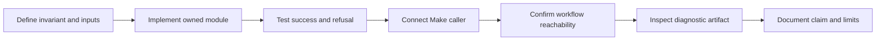

# Operating Guidelines

A maintenance helper is complete only when its rule, command contract, focused
tests, integration caller, diagnostic output, and refusal behavior agree. The
module is the testable decision owner; Make supplies a reproducible environment;
the workflow supplies timing and permissions.

```mermaid
flowchart LR
    I[Define invariant and inputs] --> M[Implement owned module]
    M --> T[Test success and refusal]
    T --> C[Connect Make caller]
    C --> W[Confirm workflow reachability]
    W --> A[Inspect diagnostic artifact]
    A --> D[Document claim and limits]
```

## Add or change a helper

1. State the invariant in terms of governed inputs and an observable verdict.
2. Select an owned module under `api`, `docs`, `quality`, `release`, `sbom`,
   `security`, or `packages/<owner>`.
3. Expose a narrow function API and, when orchestration needs it, a
   `python -m` entrypoint with explicit arguments.
4. Test valid input, malformed input, refusal conditions, and deterministic
   output before wiring orchestration.
5. Bind the helper in the narrowest reusable Make contract and route output to
   the active package or root artifact directory.
6. Confirm the relevant root or package target reaches it. A workflow should
   call that target rather than reimplementing the rule.
7. Update the module map and the domain guide that explains the evidence.

## Interface contract

Helpers should accept explicit paths rather than infer the current working
directory. Inputs that cross a package boundary must identify the repository or
package root. Output intended for automation should be deterministic, stable
enough to test, and separate from explanatory progress text.

Use exit status consistently:

| Result | Behavior |
| --- | --- |
| accepted invariant | return `0` and write the promised evidence |
| governed mismatch | nonzero status with actionable expected/observed context |
| malformed input | nonzero status naming the input and violated shape |
| unavailable required tool | nonzero status with the missing executable or capability |
| optional evidence unavailable | explicit diagnostic; never synthesize success |

Do not catch a broad exception merely to return an empty result. Expected
failures should have narrow exception types or structured diagnostics so the
caller can distinguish rejection from infrastructure failure.

## Subprocess safety

Use `trusted_process.run_text` for repository-owned subprocesses that need a
captured result. It requires an absolute executable path, rejects an empty or
relative command, accepts an explicit working directory, and converts checked
command failures into `TrustedCommandError` with return code, stdout, and
stderr.

This wrapper validates command provenance; it does not make untrusted
arguments, arbitrary shell strings, or external output trustworthy. Avoid
`shell=True` and keep command construction as an argument sequence.

## Testing strategy

Focused unit tests protect parsers, canonicalization, policy decisions, and
error messages. Repository-contract tests protect the helper-to-Make and
helper-to-workflow relationship. Publication and documentation tests protect
the public representation. A high-risk helper normally needs evidence at all
three levels, but each test should remain at the narrowest useful boundary.

Use fixtures that make the relevant invariant visible. Do not depend on a
maintainer's home directory, ambient credentials, network service, or a mutable
tool default unless that dependency is the explicit subject of an integration
test.

## Artifact discipline

Write generated schemas, audit inputs, SBOM requirements, drift reports,
release diagnostics, caches, and test output beneath the caller-provided
artifact root. If a checked-in pin or generated reference must change, keep its
governed destination explicit and review it separately from ephemeral output.

The artifact must support the claim. A summary is insufficient when the
decision depends on row-level mismatches; a generated schema is insufficient
without its comparison verdict; a tolerant SBOM generation result is
insufficient without strict validation when certification is claimed.

## Review checklist

- The module owns repository maintenance, not product behavior.
- Product packages do not gain a runtime dependency on this package.
- The helper has no catch-all or delivery-sequence name.
- Inputs, outputs, exit behavior, and artifact paths are documented and tested.
- The Make caller uses an explicit environment and path context.
- The workflow reaches the Make contract with only necessary permissions.
- Failure output identifies the rule owner and a reproducible next check.

These guidelines keep maintenance policy executable without turning the
maintenance package into a second product layer or a hidden workflow framework.
