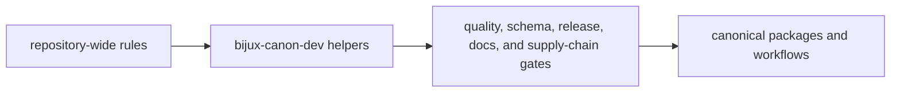

# Package Overview

`bijux-canon-dev` is not part of the end-user runtime. It exists to keep
repository-level quality, schema, release, docs, and supply-chain rules visible
and reusable across the monorepo.

That makes it a boundary package. It should absorb repository-health logic that
would otherwise be duplicated or hidden, but it should refuse product-domain
behavior that belongs in a canonical package.

## Support Model

This page should make `bijux-canon-dev` feel like shared maintainer
infrastructure, not a second product package. Its value is in making
repository-wide rules reusable without absorbing end-user behavior.

## What It Owns

- repository-wide validation helpers reused across packages
- schema drift and API freeze support under `api/`
- publication guards and version resolution under `release/`
- supply-chain and requirements output under `sbom/`
- docs publication and badge support under `docs/`

## What It Refuses

- end-user runtime behavior
- package-specific domain rules that only one canonical package owns
- compatibility shims for legacy public names

## First Proof Check

- `packages/bijux-canon-dev/src/bijux_canon_dev`
- `packages/bijux-canon-dev/tests`
- call sites in `Makefile`, `makes/`, and `.github/workflows/`

## Review Rule

When a maintainer change looks convenient because it can reach many packages at
once, review the boundary first. Shared helper code is justified only when the
rule is genuinely repository-wide and still understandable from checked-in code
and tests.

## Design Pressure

The pressure on `bijux-canon-dev` is to centralize repository-health behavior
without becoming a dumping ground for product logic. Once maintainers use it to
hide package-specific policy, the shared surface stops being defensible.
