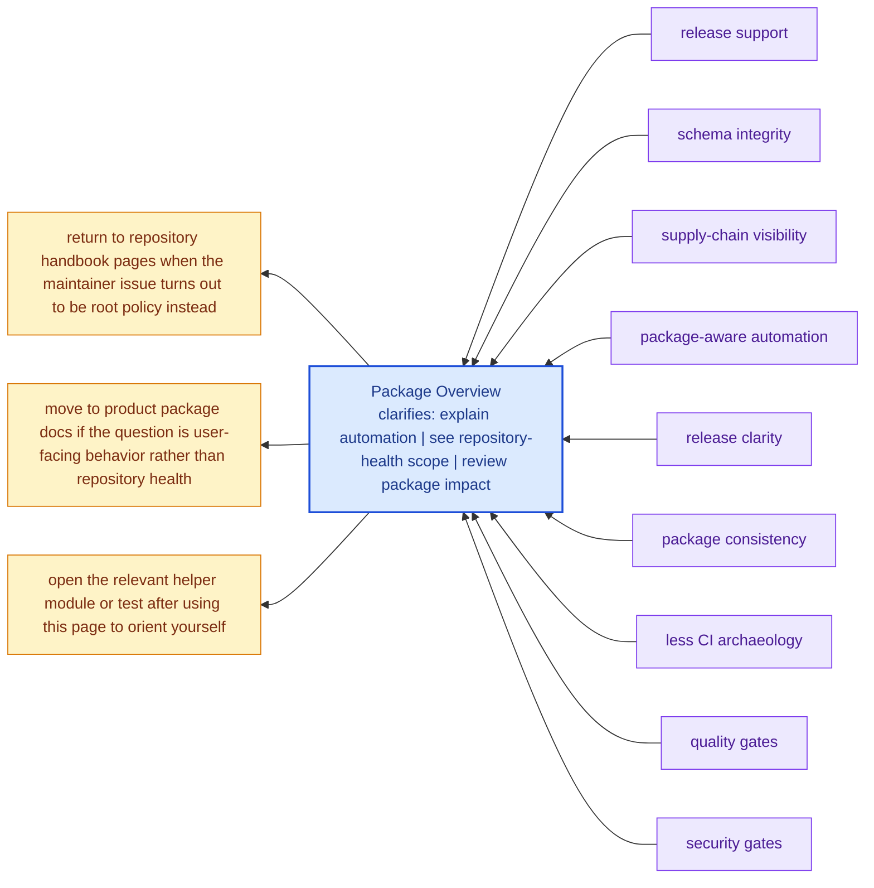

# Package Overview

`bijux-canon-dev` is intentionally not part of the end-user runtime. It is
the package that keeps the monorepo honest when schemas drift, security
tooling falls behind, or release metadata becomes inconsistent.

A good maintainer package should reduce mystery, not create a new layer of
it. This page should help readers see why the automation exists and why it
does not belong in the product packages themselves.

These maintainer pages should read like explicit operational memory for repository-health work. They are strongest when they expose automation intent, package impact, and repository policy without pretending that CI logs are documentation.

## Visual Summary

## What It Owns

- shared quality and security helpers used across packages
- release, versioning, and SBOM helpers
- OpenAPI and schema drift tooling
- package-specific maintenance helpers invoked by root automation

## Concrete Anchors

- `packages/bijux-canon-dev/src/bijux_canon_dev` for maintainer helpers
- `packages/bijux-canon-dev/tests` for executable maintenance proof
- `apis/` and root workflows for repository-level integration points

## Use This Page When

- you are changing repository automation, validation, or release support
- you need maintainer-only context that should not live in product package docs
- you are reviewing CI, schema drift, or supply-chain behavior

## Decision Rule

Use `Package Overview` to decide whether a change belongs to maintainer automation or to a product package contract. If the change would affect end-user behavior directly, this page should push the review back toward the owning product package instead of letting maintainer scope sprawl.

## What This Page Answers

- which repository maintenance concern this page explains
- which maintainer modules or tests support that concern
- what a reviewer should confirm before changing repository automation

## Reviewer Lens

- compare the described maintainer behavior with the actual helper modules and tests
- check that maintainer-only guidance has not leaked into product-facing pages
- confirm that repository automation still names its package impact explicitly

## Next Checks

- move to product package docs if the question is user-facing behavior rather than repository health
- open the relevant helper module or test after using this page to orient yourself
- return to repository handbook pages when the maintainer issue turns out to be root policy instead

## Honesty Boundary

This section can describe maintainer automation and repository health work, but it should never imply that maintainer tooling is part of the end-user product surface. It also should not pretend that hidden scripts count as documentation just because CI happens to run them.

## Purpose

This page gives the shortest honest description of why the package exists.

## Stability

Keep this page aligned with real maintainer behavior, not aspirational tooling that does not yet exist.
