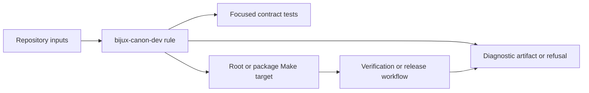
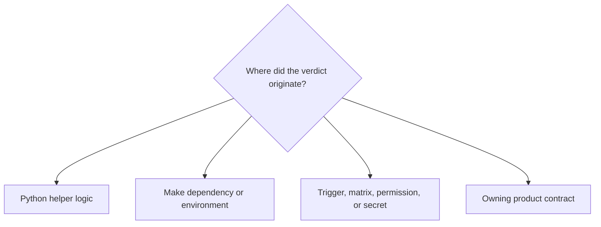

# Package Overview

`bijux-canon-dev` is the internal Python package that implements repository
health and publication policy for Bijux Canon. It turns cross-package rules
into importable, testable modules that Make targets and GitHub workflows can
invoke consistently.

It is not an end-user runtime package, does not publish a general-purpose
console command, and is excluded from the public release package set.


```mermaid
flowchart LR
    inputs[Repository inputs] --> helper[bijux-canon-dev rule]
    helper --> tests[Focused contract tests]
    helper --> make[Root or package Make target]
    make --> workflow[Verification or release workflow]
    helper --> artifact[Diagnostic artifact or refusal]
    workflow --> artifact
```

## Authority

The package owns decisions that must be identical across several packages or
repository surfaces:

| Area | Governed decision |
| --- | --- |
| API | whether schema YAML, pinned JSON, hashes, and application OpenAPI agree |
| documentation | whether generated configuration, navigation, publication metadata, and badge blocks remain consistent |
| quality | whether dependency declarations agree with imports under repository policy |
| security | whether normalized dependency-audit findings pass the configured gate |
| release | which version is resolved and whether built artifacts are publishable under that version |
| SBOM | which production and development requirements feed CycloneDX generation |
| package adapters | whether agent, index, and runtime repository-specific constraints hold |

The package may inspect product packages, their metadata, and their public
application objects. It does not decide how ingest normalizes content, index
ranks results, reason grounds claims, agent orchestrates roles, or runtime
admits execution.

## Execution Model

Each rule follows the same separation of responsibility:

1. a Python module parses and validates governed input;
2. a focused unit or repository contract test defines expected behavior;
3. a Make fragment supplies stable paths, environments, and artifact
   destinations;
4. a workflow selects trigger, permissions, matrix, and publication context;
5. exit status and structured output become review evidence.


```mermaid
flowchart TD
    decision{Where did the verdict originate?}
    python[Python helper logic]
    make[Make dependency or environment]
    workflow[Trigger, matrix, permission, or secret]
    product[Owning product contract]

    decision --> python
    decision --> make
    decision --> workflow
    decision --> product
```

Diagnose the layer that made the disputed decision. Changing a workflow label
cannot repair schema canonicalization. Changing helper code cannot repair a
missing workflow permission. A product failure remains in the product package
unless the repository gate misclassified valid product evidence.

## Packaging Contract

`bijux-canon-dev` supports Python 3.11 through 3.14 and declares only
`packaging` and `PyYAML` as runtime dependencies. Repository test, docs,
security, build, and audit tools live in its `dev` optional dependency group.
The wheel contains `bijux_canon_dev`, typing metadata, license, notice,
changelog, and README.

The package version resolves from the repository’s `v<version>` tag through
Hatch VCS. Being buildable does not make it a public application dependency;
its distribution exists to make repository tooling reproducible.

## Invocation Contract

Modules are independently callable with `python -m`, for example:

```bash
python -m bijux_canon_dev.api.freeze_contracts --repo-root .

python -m bijux_canon_dev.release.publication_guard \
  --pyproject packages/bijux-canon-runtime/pyproject.toml \
  --package-name bijux-canon-runtime \
  --dist-dir artifacts/bijux-canon-runtime/dist
```

Normal repository work should use the corresponding Make target because it
provides the maintained environment and output paths. Direct invocation is
useful for focused diagnosis and module tests; it does not prove that the
workflow calls the module under the intended trigger and permissions.

## Failure Semantics

Helpers fail explicitly when governed input is absent, malformed, inconsistent,
or disallowed. Examples include:

- a missing OpenAPI pin or digest;
- drift between checked-in and generated schema;
- a missing or unreadable audit report in strict mode;
- a prerelease or local version presented for normal publication;
- built artifact versions that differ from the resolved package version;
- a documentation or package inventory that violates repository contracts.

Do not turn these failures into unconditional success in shell or workflow
code. Correct the governed input or change the policy with its tests and public
consequence visible.

## Trust Boundary

The package’s subprocess wrapper accepts only an absolute executable path and
returns or raises with captured process details. This protects repository-owned
command execution from accidental PATH ambiguity; it is not a sandbox for
untrusted commands or inputs.

Repository checks can establish consistency and publication readiness. They do
not establish product correctness beyond the evidence exposed by each owning
package.

See [Module Map](module-map.md) for implementation ownership,
[Operating Guidelines](operating-guidelines.md) for extension rules, and the
[Maintenance Handbook](../index.md) for Make and workflow composition.
