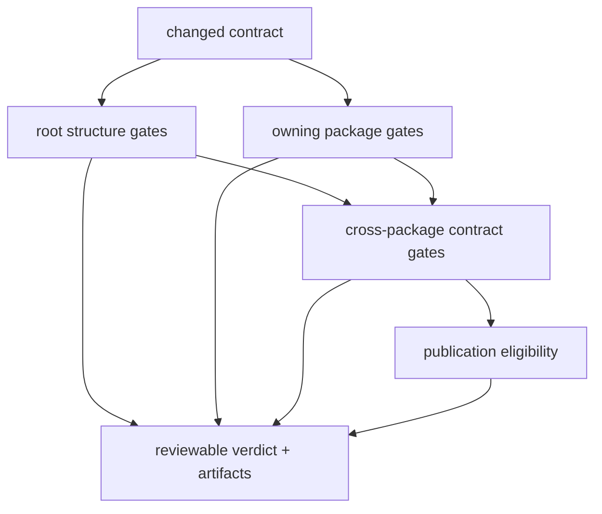

# Quality Gates

Repository quality is established by focused gates with named inputs and
failure semantics. `bijux-canon-dev` owns rules that span repository structure;
product packages retain the tests and invariants for their own behavior.

## Gate Topology

Not every change traverses every node. Documentation edits require the strict
site build and publication contracts. A dependency edit reaches lock,
dependency-use, security, and affected package tests. A public API edit reaches
schema drift, pins, hashes, implementation tests, and live contract checks.

## Repository Gates

| Contract | Implementation or test | Failure means |
| --- | --- | --- |
| workspace and package sets are coherent | root `pyproject.toml` contract and package-profile tests | dispatch or release membership cannot be trusted |
| root configuration has the required shape | config-baseline and tooling contract tests | a shared tool may run with missing or misplaced configuration |
| Make profiles and targets remain discoverable | Make-layout checks and repository operations tests | local and CI command routing may diverge |
| documentation navigation is complete | `test_docs_navigation_contract.py` | a public page is missing, duplicated, or routed incorrectly |
| published documentation is reader-safe and buildable | `test_docs_publication_contract.py`, MkDocs config tests, `make docs-check` | the site contract or strict build is invalid |
| checked-in OpenAPI contracts match applications | `api.openapi_drift`, API freeze tests, repository API tests | schema source, generated representation, pin, hash, or live behavior disagrees |
| declared dependencies match imports | `quality.deptry_scan` and package quality targets | dependency metadata is incomplete or carries unused declarations outside policy |
| release metadata names eligible packages | publication and release-history tests | a package/version cannot enter the publication graph safely |

## Select Evidence By Change

| Change | Minimum focused evidence | Broaden to |
| --- | --- | --- |
| one Markdown page | strict docs build and publication contract tests | navigation tests if paths or routing changed |
| MkDocs configuration or generated docs catalog | config, navigation, publication tests and strict build | deployment workflow contract if hosting inputs changed |
| one maintainer helper | helper's unit tests | Make and workflow contract tests when integration changed |
| package dependency declaration | focused package tests, dependency scan, lock check | security audit and downstream package tests |
| OpenAPI operation | owning API tests, drift and freeze checks | live contract and affected client tests |
| public release inventory | package-profile, metadata, publication, and release tests | build and artifact staging checks |

“Minimum” means the smallest set that actually exercises the changed contract,
not the fewest commands. A passing unrelated lane provides no additional
support for the claim under review.

## Diagnose A Refusal

1. Identify the failed contract from the test or helper name.
2. Inspect the governed input named in the diagnostic.
3. Reproduce with the narrowest Make target or focused test selection.
4. Correct the owning input or rule; do not mask the exit status in a wrapper.
5. Retain the diagnostic under `artifacts/` when it is needed for review.
6. Run the cross-boundary gate only if the correction changes an integration.

Gate code must refuse unsupported states explicitly. Allowlisting, filtering,
or skipping is valid only when the policy itself owns and tests that exception;
silencing an unexpected failure destroys the evidence the gate exists to
produce.

## Ownership Boundary

A repository gate may verify that every canonical package has an API contract,
but the owning package decides what its API means. It may verify that runtime's
dependency allowlist is satisfied, but runtime owns the dependency boundary.
Move a rule into `bijux-canon-dev` only when the governed fact is genuinely
repository-wide or requires repository-level inventory.

Continue with [security gates](security-gates.md) for vulnerability policy and
[schema governance](schema-governance.md) for the OpenAPI evidence chain.
