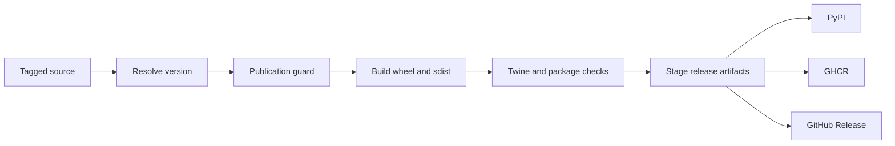
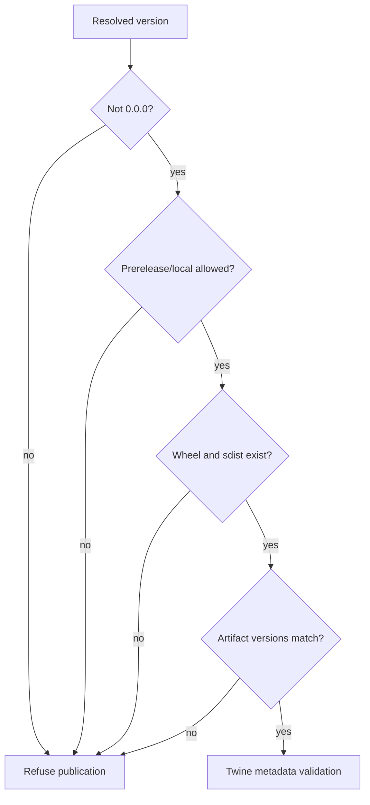

# Release Support

Bijux Canon resolves one tag-derived release line into independently built
Python distributions and specialized PyPI, GHCR, and GitHub Release paths.
`bijux-canon-dev` owns version resolution and publication eligibility; build
logic owns wheel and source-distribution construction; workflows own registry
credentials and publication timing.



## Version Resolution

`release.version_resolver` evaluates sources in order:

1. a static `[project].version`, when declared;
2. `python -m hatch version` in the package directory;
3. the latest Git tag matching the package’s Hatch tag pattern or package tag
   convention;
4. `0.0.0` when none resolves.

The repository packages normally use Hatch VCS and the shared `v<version>` tag
pattern. A dirty or untagged checkout can resolve to a development or local
version suitable for testing but not normal publication.

## Publication Guard

`release.publication_guard` rejects:

- prerelease identifiers unless `--allow-prerelease` is explicit;
- local or dirty version identifiers unless `--allow-local-version` is
  explicit;
- a distribution directory with no recognized wheel or source distribution;
- artifact filenames whose parsed version differs from the resolved version.

The Make integration separately refuses unresolved `0.0.0` and requires at
least one wheel and one source distribution. Exceptions permit an intentional
prerelease or local publication; they do not change the version embedded in
built files. The guard parses both wheel and `.tar.gz` filenames and reports
every mismatch.



## Build Evidence

The shared build path creates both wheel and source distribution beneath the
configured package artifact directory and runs `twine check` unless explicitly
disabled. Repository contract tests additionally verify that public packages:

- include package source, README, and changelog in the source distribution;
- include typing metadata in the wheel;
- force-include the repository license;
- link package legal files to the root authority;
- keep package-local build products ignored;
- preserve compatibility-package build boundaries.

Package profiles may add release-specific checks before or after the common
build. Inspect the selected package’s `release-dry` behavior rather than
assuming all distributions have identical evidence.

## Wheel Family Verification

The installed `bijux-canon-wheel-inventory` command validates the exact
workspace wheel and source-archive family against checked-in metadata. The repository
workspace currently declares twelve distributions; the non-publishable root
project is not a thirteenth release artifact.
It compares names, one shared version, Python constraints, dependencies,
optional extras, console entry points, and license declarations. It also
verifies archive paths, wheel tags, every `RECORD` hash and byte count, exact
copies of `LICENSE` and `NOTICE`, declared runtime assets such as `py.typed` and
schema hashes, and the absence of source-tree, test, cache, and local path
leaks. Each distribution must also have exactly one safe, same-version source
archive with matching `PKG-INFO` and a packaged `pyproject.toml`. A real
`twine check` over every wheel and source archive is part of the result.

```bash
bijux-canon-wheel-inventory \
  --repo-root . \
  --wheel-dir artifacts/release/wheels \
  --output artifacts/release/wheel-inventory.json
```

The command requires a clean checkout and writes the Twine command outcome,
wheel and source-archive hashes, source metadata hashes, lock hash, environment identity, package
results, and retained failures to the requested JSON file. The wheel directory,
cache, and result must remain under `artifacts/`; the validator and its tests
remain in `bijux-canon-dev` so the same release contract survives disposal of a
particular run's evidence.

## Clean Installation Verification

The installed `bijux-canon-installation-matrix` command creates a clean
environment for every wheel and one additional environment for the complete
exact family. Candidate constraints bind any sibling distribution selected by
dependency resolution to the same wheel version. A separate sealed dependency
wheelhouse supplies third-party wheels; every install forces `--no-index` and
rejects candidate distributions duplicated in that wheelhouse. Each row runs the package
manager consistency check, imports modules with Python isolation enabled,
loads all installed entry points, resolves declared runtime data from
`site-packages`, and invokes each console command's help surface. Imports or
data that resolve into the repository source tree fail the row.

```bash
bijux-canon-installation-matrix \
  --repo-root . \
  --wheel-dir artifacts/release/wheels \
  --dependency-wheel-dir artifacts/release/dependency-wheels \
  --environment-root artifacts/release/installations \
  --output artifacts/release/install-matrix.json
```

The result retains every environment-creation, installation, consistency,
inspection, and command outcome. Cross-platform and cross-Python coverage is
composed with the supported Python matrix; one local installation run does not
imply those remote runner results.

## Advertised Extras Verification

The installed `bijux-canon-extras-matrix` command installs and exercises every
advertised extra in isolation. It uses the same sealed dependency wheelhouse as
the clean installation matrix, disables public-index access, verifies imported
capabilities resolve from the isolated environment, and retains dependency
wheel hashes with every command outcome.

```bash
bijux-canon-extras-matrix \
  --repo-root . \
  --wheel-dir artifacts/release/wheels \
  --dependency-wheel-dir artifacts/release/dependency-wheels \
  --environment-root artifacts/release/extras \
  --output artifacts/release/extras-matrix.json
```

## Supported Python Verification

The installed `bijux-canon-python-support` command treats package metadata as
the support authority. It refuses classifier drift between packages, a
`requires-python` contradiction, missing or duplicate wheels, mixed package
versions, malformed wheel metadata, unsafe archive paths, an incomplete
canonical/compatibility partition, or a missing platform promise. It then
installs the exact repository-and-package wheel family under every advertised
Python minor, runs the package-manager consistency check, imports every shipped
module from the isolated `site-packages`, and loads every console entry point.
The result carries a distinct status for all 48 package and interpreter
combinations.

```bash
bijux-canon-python-support \
  --repo-root . \
  --wheel-dir artifacts/release/wheels \
  --environment-root artifacts/release/python-support/environments \
  --output artifacts/release/python-support/result.json
```

The command requires a clean checkout so the recorded full source commit names
the exact tested tree. Wheel inputs, environments, caches, command logs, and the
JSON result must stay under `artifacts/`; they are run evidence, not product
source. The local result records its platform explicitly. Multi-platform
enforcement remains a remote-runner responsibility and must not be inferred
from a single local pass.

## Local Publication Is Safe by Default

```bash
make -C packages/bijux-canon-runtime publish
```

The shared `publish` target checks the version, builds artifacts, and validates
them. Upload is disabled unless `PUBLISH_UPLOAD_ENABLED=1`. `publish-test`
similarly requires its explicit enable flag. Registry upload refuses missing
credentials.

`SKIP_TWINE_CHECK=1`, prerelease allowance, local-version allowance, and
`SKIP_EXISTING=1` are visible policy choices. `--skip-existing` avoids failing
on a version already present; it cannot replace immutable registry bytes and
must not be used to imply that the local build is identical to the published
artifact.

TestPyPI installation verification exists only when a package configures
`PUBLISH_VERIFY_INSTALL_CMD`. An unconfigured target reports that it did not
run; it is not an installation pass.

## Workflow Separation

| Workflow | Authority |
| --- | --- |
| `release-artifacts.yml` | build and stage package distributions and optional SBOM assets |
| `release-pypi.yml` | publish staged Python distributions |
| `release-ghcr.yml` | publish OCI release bundles to GHCR |
| `release-github.yml` | create or update GitHub Release assets |

Staging and publication remain separate so artifact contents can be reviewed
before credentials are used. A successful artifact build does not prove PyPI
publication, and a successful registry upload does not prove that GitHub
Release or SBOM staging completed.

## Release Acceptance Record

Retain:

- source tag, commit SHA, clean/dirty state, and resolved version;
- selected public package and compatibility-package inventory;
- wheel and source-distribution filenames and registry identities;
- publication-guard and Twine results;
- package-specific release-dry evidence;
- production and development SBOMs plus validation results;
- workflow run IDs and destination-specific publication results;
- changelog and compatibility decisions for caller-visible changes.

Published bytes are immutable. Recovery from an incorrect release uses a new
source decision and version, with yanking or deprecation where supported; it
does not rebuild and overwrite the existing version.

## Failure Routing

| Failure | Owning boundary |
| --- | --- |
| version is `0.0.0` or dirty | version resolver, tag, or checkout state |
| artifact version mismatch | build environment or stale artifact directory |
| Twine metadata refusal | package metadata or build contents |
| missing wheel or sdist | build target and staged artifact path |
| missing PyPI credential | publication workflow or local secret injection |
| package absent from matrix | root public release inventory and workflow inputs |
| compatibility artifact points to wrong owner | compatibility package metadata and contract tests |
| SBOM absent | SBOM generation, validation, or release staging |

See [SBOM and Supply Chain](sbom-and-supply-chain.md) for inventory evidence,
the root [Release and Versioning](../../01-bijux-canon/operations/release-and-versioning.md)
guide for package-family policy, and [Release Workflows](../gh-workflows/release-workflows.md)
for workflow orchestration.
