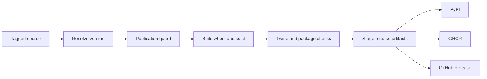
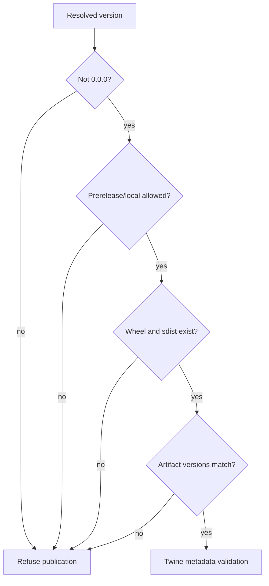

# Release Support

Bijux Canon resolves one tag-derived release line into independently built
Python distributions and specialized PyPI, GHCR, and GitHub Release paths.
`bijux-canon-dev` owns version resolution and publication eligibility; build
logic owns wheel and source-distribution construction; workflows own registry
credentials and publication timing.



## Version Resolution

`release.version_resolver` evaluates sources in order:

1. a static `[project].version`, when declared;
2. `python -m hatch version` in the package directory;
3. the latest Git tag matching the package’s Hatch tag pattern or package tag
   convention;
4. `0.0.0` when none resolves.

The repository packages normally use Hatch VCS and the shared `v<version>` tag
pattern. A dirty or untagged checkout can resolve to a development or local
version suitable for testing but not normal publication.

## Publication Guard

`release.publication_guard` rejects:

- prerelease identifiers unless `--allow-prerelease` is explicit;
- local or dirty version identifiers unless `--allow-local-version` is
  explicit;
- a distribution directory with no recognized wheel or source distribution;
- artifact filenames whose parsed version differs from the resolved version.

The Make integration separately refuses unresolved `0.0.0` and requires at
least one wheel and one source distribution. Exceptions permit an intentional
prerelease or local publication; they do not change the version embedded in
built files. The guard parses both wheel and `.tar.gz` filenames and reports
every mismatch.



## Build Evidence

The shared build path creates both wheel and source distribution beneath the
configured package artifact directory and runs `twine check` unless explicitly
disabled. Repository contract tests additionally verify that public packages:

- include package source, README, and changelog in the source distribution;
- include typing metadata in the wheel;
- force-include the repository license;
- link package legal files to the root authority;
- keep package-local build products ignored;
- preserve compatibility-package build boundaries.

Package profiles may add release-specific checks before or after the common
build. Inspect the selected package’s `release-dry` behavior rather than
assuming all distributions have identical evidence.

## Local Publication Is Safe by Default

```bash
make -C packages/bijux-canon-runtime publish
```

The shared `publish` target checks the version, builds artifacts, and validates
them. Upload is disabled unless `PUBLISH_UPLOAD_ENABLED=1`. `publish-test`
similarly requires its explicit enable flag. Registry upload refuses missing
credentials.

`SKIP_TWINE_CHECK=1`, prerelease allowance, local-version allowance, and
`SKIP_EXISTING=1` are visible policy choices. `--skip-existing` avoids failing
on a version already present; it cannot replace immutable registry bytes and
must not be used to imply that the local build is identical to the published
artifact.

TestPyPI installation verification exists only when a package configures
`PUBLISH_VERIFY_INSTALL_CMD`. An unconfigured target reports that it did not
run; it is not an installation pass.

## Workflow Separation

| Workflow | Authority |
| --- | --- |
| `release-artifacts.yml` | build and stage package distributions and optional SBOM assets |
| `release-pypi.yml` | publish staged Python distributions |
| `release-ghcr.yml` | publish OCI release bundles to GHCR |
| `release-github.yml` | create or update GitHub Release assets |

Staging and publication remain separate so artifact contents can be reviewed
before credentials are used. A successful artifact build does not prove PyPI
publication, and a successful registry upload does not prove that GitHub
Release or SBOM staging completed.

## Release Acceptance Record

Retain:

- source tag, commit SHA, clean/dirty state, and resolved version;
- selected public package and compatibility-package inventory;
- wheel and source-distribution filenames and registry identities;
- publication-guard and Twine results;
- package-specific release-dry evidence;
- production and development SBOMs plus validation results;
- workflow run IDs and destination-specific publication results;
- changelog and compatibility decisions for caller-visible changes.

Published bytes are immutable. Recovery from an incorrect release uses a new
source decision and version, with yanking or deprecation where supported; it
does not rebuild and overwrite the existing version.

## Failure Routing

| Failure | Owning boundary |
| --- | --- |
| version is `0.0.0` or dirty | version resolver, tag, or checkout state |
| artifact version mismatch | build environment or stale artifact directory |
| Twine metadata refusal | package metadata or build contents |
| missing wheel or sdist | build target and staged artifact path |
| missing PyPI credential | publication workflow or local secret injection |
| package absent from matrix | root public release inventory and workflow inputs |
| compatibility artifact points to wrong owner | compatibility package metadata and contract tests |
| SBOM absent | SBOM generation, validation, or release staging |

See [SBOM and Supply Chain](sbom-and-supply-chain.md) for inventory evidence,
the root [Release and Versioning](../../01-bijux-canon/operations/release-and-versioning.md)
guide for package-family policy, and [Release Workflows](../gh-workflows/release-workflows.md)
for workflow orchestration.
