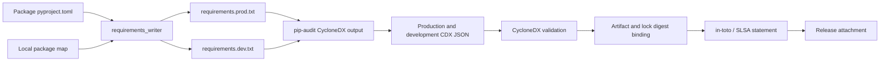
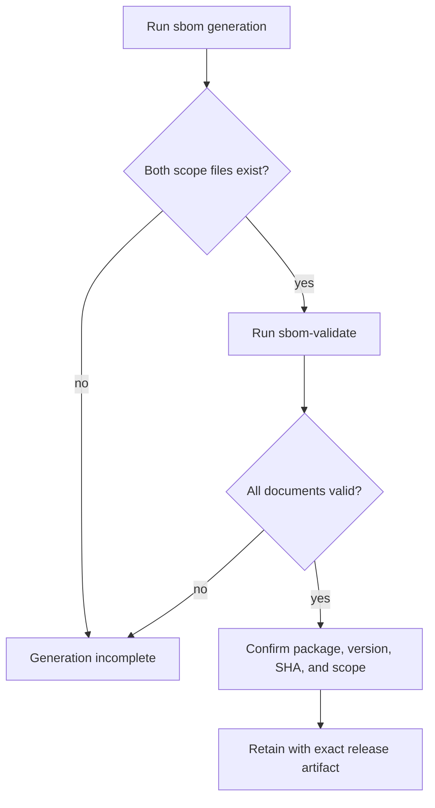

# SBOM and Supply Chain

Bijux Canon has two related CycloneDX surfaces. Package Make targets generate
production and development dependency inventories. The installed
`bijux-canon-supply-chain` command scans every release wheel or OCI archive and
binds its SBOM to the artifact, source commit, governing locks, builder identity,
and an in-toto/SLSA provenance statement. Generated files remain beneath
`artifacts/`; the generator and verifier live in `bijux-canon-dev`.



## Requirement Inputs

`sbom.requirements_writer` reads `[project].dependencies` for the production
set. For the development set it appends the selected optional dependency group,
which defaults to `dev`. Requirement strings are deduplicated in declaration
order.

Workspace dependencies are rewritten as absolute `file:` requirements pointing
at the package checkout. Extras and environment markers are preserved. This
lets the downstream resolver inspect the local source instead of requiring an
already published sibling version.

The generated requirements files are inputs, not complete SBOMs. They begin
from direct package metadata; pip-audit performs downstream dependency
resolution and writes the CycloneDX document.

## Output Identity

Default package output lives under `artifacts/<package>/sbom/`:

```text
requirements.prod.txt
requirements.dev.txt
<package>-<resolved-version>-<git-sha>.prod.cdx.json
<package>-<resolved-version>-<git-sha>.dev.cdx.json
summary.txt
```

The filename records package, resolved version, short Git SHA, and dependency
scope. If version resolution is unavailable, the Make layer can fall back to
`0.0.0`; such a filename is diagnostic evidence, not release-quality version
identity.

Production and development inventories answer different questions. The
production document approximates dependencies needed by consumers; the
development document also covers tools used to test, document, audit, and
build the package. Never publish one scope under the other’s name.

## Generation and Validation Are Separate

The `sbom` target cleans prior SBOM output, generates both scopes, and writes a
component-count summary. Pip-audit failures remain fatal and vulnerability
ignore IDs are rejected. Generation and structural validation are still
separate decisions: `make sbom` must produce both expected documents, while
`sbom-validate` proves that the retained JSON satisfies CycloneDX validation.

Use the separate validator for an acceptance claim:

```bash
make sbom PACKAGE=bijux-canon-runtime
make -f "$PWD/makes/packages/bijux-canon-runtime.mk" \
  -C packages/bijux-canon-runtime sbom-validate
```

The root dispatcher exposes `sbom`; the validator is a package-profile target.
Package directories do not contain standalone Makefiles, so direct validation
must include the repository profile path.

`sbom-validate` refuses a missing CLI, an empty SBOM directory, or any document
rejected by `cyclonedx validate`. Inspect the generated files and command output
before reporting success.



## Supply-Chain Claim Ladder

An SBOM moves through independent decisions. Preserve the evidence for every
rung actually claimed:

| Claim | Required evidence | Does not establish |
| --- | --- | --- |
| dependency input was prepared | package metadata plus generated production or development requirements | successful dependency resolution |
| inventory was generated | nonempty CycloneDX JSON plus pip-audit completion record | structural validity or vulnerability acceptance |
| inventory is structurally valid | successful `cyclonedx validate` result for the exact bytes | that every dependency is safe or complete |
| vulnerability policy accepted the resolution | audit report, strict gate policy, and gate verdict | artifact provenance or build reproducibility |
| SBOM was staged with a release candidate | stable staged name, workflow run, source SHA, and package version | publication at a registry or release page |
| published SBOM describes a released artifact | destination identity, SBOM digest, wheel/sdist or image digest, and common tagged source | trusted signature or runtime safety |
| local provenance binds the release candidate | successful `bijux-canon-supply-chain` verification of artifact, SBOM, source, locks, builder, and in-toto subject | trusted remote builder or key custody |

The repository provides generation, validation, audit policy, artifact binding,
and unsigned local build-provenance attestations as separate surfaces. It does
not provide a trusted remote builder or signature. Consumers needing those
guarantees must add a trusted signing control and verify the exact attestation
bytes rather than infer trust from CycloneDX presence.

## Artifact-Bound Manifest

Run the installed tool from a clean source tree after the complete release
candidate set has been built:

```bash
bijux-canon-supply-chain \
  --repo-root "$PWD" \
  --wheel-dir artifacts/release/dist \
  --output-dir artifacts/release/supply-chain \
  --manifest artifacts/release/supply-chain.json \
  --lock uv.lock \
  --lock pyproject.toml
```

Every wheel in `--wheel-dir` is scanned. Each generated CycloneDX document must
be structurally valid and contain identified components. The manifest records
SHA-256 and byte length for the artifact, SHA-256 for the SBOM and attestation,
the full source commit, lock identities, builder identity, and a relative path
for each retained output. Verification recomputes all digests and checks the
in-toto subject plus SLSA source, SBOM, lock, and builder fields.

Use one `--oci-image` argument per OCI archive. If a tracked Dockerfile or
Containerfile exists but no OCI archive is supplied, the command fails instead
of reporting empty OCI coverage. Unsafe wheel members, dirty source, missing
locks, duplicate names, and any binding mismatch also fail closed.

## Vulnerability Policy

SBOM generation rejects vulnerability ignore IDs and preserves pip-audit’s
nonzero result. A vulnerable component therefore fails generation instead of
producing an apparently acceptable inventory. Resolve the dependency before
staging release evidence.

Supply-chain inventory and vulnerability policy remain separate claims. An
SBOM can be structurally valid while describing a vulnerable component, and a
clean audit can still be incomplete if dependency resolution failed.

## Release Staging

The release-artifact workflow stages available files under stable names:

- `<package>-sbom-prod.cdx.json`;
- `<package>-sbom-dev.cdx.json`;
- `<package>-sbom-summary.txt`.

The workflow skips the SBOM attachment block when the directory is absent and
ignores unrecognized filenames. Staged Actions artifacts are retained for 14
days. The build and release decision must therefore check that required SBOM
assets were actually staged rather than infer their presence from workflow
success elsewhere.

## Consumer Verification

Retain an SBOM with the exact wheel, source distribution, or OCI artifact it
describes. Confirm:

- package and version identity match the release;
- the Git SHA belongs to the tagged source;
- production and development scopes are not conflated;
- the JSON passes CycloneDX validation;
- local `file:` references have been interpreted in the build context;
- vulnerability exceptions and audit date are available;
- the release asset bytes and registry identity are preserved.

The package SBOM path provides dependency inventory and component counts. The
artifact-bound path adds local source, lock, builder, and attestation identity.
Neither path signs artifacts, proves reproducible builds, establishes a trusted
remote builder, or establishes runtime safety. Those claims require separate
controls and evidence.

## Failure Routing

| Symptom | Inspect first |
| --- | --- |
| requirements file is empty | package dependency metadata and selected optional group |
| workspace dependency cannot resolve | local package name map and absolute package path |
| filename contains `0.0.0` | version resolver, Hatch environment, and Git tags |
| no CDX file after `make sbom` | pip-audit output and cache/network resolution |
| validation fails | document syntax, CycloneDX version, and incomplete generation |
| release lacks an SBOM | source artifact directory, naming pattern, and staging log |
| component counts differ between runs | resolver inputs, markers, Python version, and dependency index state |

See [Security Gates](security-gates.md) for audit semantics and
[Release Support](release-support.md) for version and publication authority.
