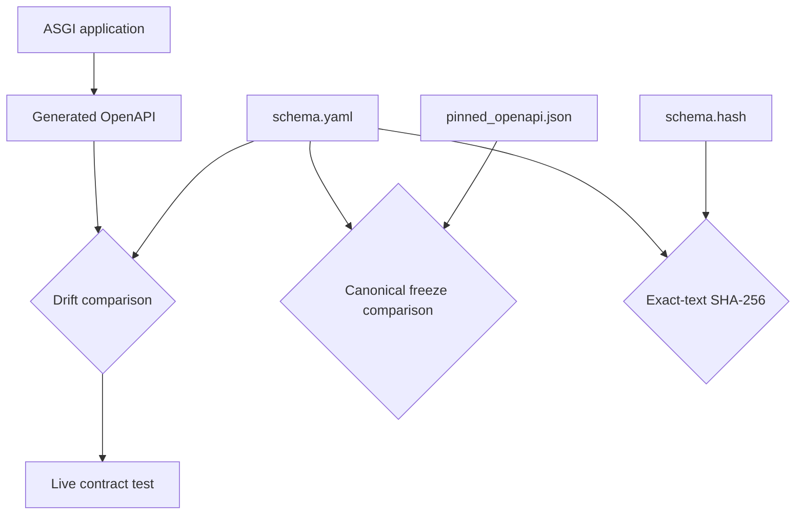

# Schema Governance

`bijux-canon-dev` implements two independent OpenAPI controls: freeze validation
for the checked-in schema set and drift validation against a package’s
application-generated schema. Together they protect representation integrity
without pretending that schema files alone prove live behavior.



## Governed Schema Set

Every governed HTTP version has the same directory shape:

```text
apis/<package>/<version>/
├── schema.yaml
├── pinned_openapi.json
└── schema.hash
```

Repository contract tests also require OpenAPI 3.1.0, package-specific titles,
matching information versions, common license/contact metadata, a root-relative
server, and at least one path. The directories may contain only those three
governed files. Runtime v2 is the primary whole-product contract; the other v1
trees remain governed package or compatibility surfaces.

## Freeze Validation

`bijux_canon_dev.api.freeze_contracts` performs two checks for every
`apis/*/*/schema.yaml`:

1. load YAML and pinned JSON, recursively sort mapping keys, normalize dates,
   enums, paths, tuples, and lists, then compare the structures;
2. hash the exact UTF-8 text of `schema.yaml` and compare it with the
   `sha256:` value in `schema.hash`.

The command refuses an empty schema tree, missing pins, missing hash files,
structural mismatch, and digest mismatch. Canonical comparison ignores mapping
order; the digest intentionally does not. A formatting-only YAML edit therefore
requires a new digest even when the pinned JSON remains structurally equal.

```bash
python -m bijux_canon_dev.api.freeze_contracts --repo-root .
```

The maintained root entrypoint is `make api-freeze` through the repository API
Make fragments.

## Application Drift

`bijux_canon_dev.api.openapi_drift` accepts a `module:attribute` import. The
attribute may be an application with `.openapi()` or a zero-argument factory.
The helper writes generated canonical JSON beneath the configured artifact path
before comparing it with the checked-in YAML or JSON source.

On mismatch, the diagnostic identifies both generated and expected paths. The
`--pin` option writes generated content back to the file passed as `--schema`;
it does not synchronize `pinned_openapi.json` or `schema.hash`. After an
intentional source update, regenerate or update the full governed set and run
freeze validation.

## Package API Modes

Package profiles compose the available controls:

| Control | Establishes | Typical evidence |
| --- | --- | --- |
| schema lint | OpenAPI document passes Prance and OpenAPI Spec Validator | per-schema lint logs |
| freeze | YAML, pin, and hash agree | repository freeze verdict |
| drift | application-generated schema matches checked-in source | `openapi.generated.json` and comparison result |
| live contract | an ephemeral local server conforms for generated requests | Schemathesis log and server diagnostics |

Some profiles use freeze-only behavior; live profiles configure an application
import and start Uvicorn on the requested or a fallback local port. Schemathesis
checks server errors, response schema, content type, response headers, and a
bounded example set. Read the owning package profile before claiming that a
particular live check ran.

## Intentional Change Procedure

```mermaid
flowchart LR
    behavior[Change owning application] --> generate[Generate OpenAPI artifact]
    generate --> review[Review semantic diff]
    review --> source[Update schema.yaml]
    source --> pin[Update pinned JSON]
    pin --> hash[Update schema digest]
    hash --> focused[Run lint, freeze, and drift]
    focused --> live[Run applicable live contract tests]
    live --> guidance[Update caller guidance and compatibility record]
```



Review semantic differences before writing pins. A new required field, enum
member, status code, authentication rule, or previously unavailable operation
can affect callers even when OpenAPI classifies it as additive.

Never edit only the generated artifact to make drift disappear. The owning
application is authoritative for behavior, `schema.yaml` is authoritative for
the reviewed representation, and the pin and digest make drift visible.

## Diagnose Failures

| Failure | Inspect first |
| --- | --- |
| missing schema tree | package inventory and `apis/` directory name |
| canonical pin mismatch | first structural YAML/JSON difference |
| digest mismatch only | exact YAML bytes, newline, comments, and hash value |
| application drift | generated JSON versus source schema, then route/model change |
| lint failure | invalid reference, type, operation, or OpenAPI version |
| live contract failure | server log, failing request, response, then declared schema |

Generated schemas, server logs, ports, and Schemathesis output belong under
`artifacts/`. Retain them for review when they explain a refusal; do not commit
them as a fourth schema authority.

See the root [API and Schema Governance](../../01-bijux-canon/operations/api-and-schema-governance.md)
page for compatibility decisions and the owning package’s API reference for
operation semantics and implementation limits.
