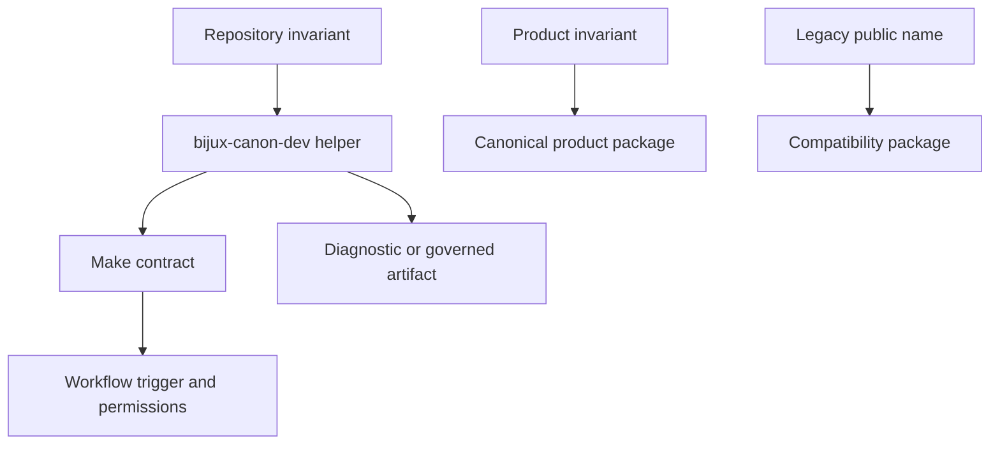

# Scope and Non-Goals

`bijux-canon-dev` owns executable repository-maintenance policy that benefits
from structured Python, focused tests, and stable diagnostics. It is called by
Make and workflows but remains outside product execution and compatibility
routing.

## Owned responsibilities

The package owns rules whose inputs and meaning span repository maintenance:

- OpenAPI freeze, schema hash, and application-to-schema drift checks;
- effective MkDocs configuration, public documentation inventory, generated
  references, and badge synchronization;
- dependency-declaration analysis and vulnerability-policy normalization;
- version resolution, publication eligibility, and distribution metadata
  consistency;
- production and development dependency inputs for SBOM generation;
- package-bound hygiene reports that protect a repository invariant; and
- safe execution support for repository-owned absolute commands.

The package also protects its integration contracts through tests for package
profiles, documentation navigation and publication, release artifacts,
workflows, root configuration, workspace layout, and compatibility wrappers.

## Explicit non-goals

`bijux-canon-dev` does not own:

- ingest normalization, index execution, reasoning, agent orchestration, or
  runtime admission;
- product domain models, protocols, persistence formats, or public APIs;
- compatibility imports, command aliases, wheel names, or deprecation behavior;
- workflow triggers, permissions, environments, or external credentials;
- generic convenience utilities without an identified repository rule; or
- a catch-all maintainer CLI that hides module ownership.

Product packages must not depend on `bijux-canon-dev` at runtime. Its declared
runtime dependencies are limited to tools needed to interpret maintenance
inputs; optional development dependencies supply its own tests and quality
toolchain.

## Ownership test

Place a helper here only when all of these statements are true:

1. the rule protects repository health, cross-package representation, or
   release evidence;
2. structured parsing, comparison, or diagnostic behavior is clearer in Python
   than in a Make recipe;
3. the input, output, refusal behavior, and caller can be named;
4. focused tests can define the rule independently of CI; and
5. no canonical package or compatibility wrapper is the more honest owner.

If only the caller is shared but the meaning is product-specific, keep the
implementation in the product package and let maintenance automation invoke its
public validation surface.

## Borderline examples

| Requirement | Owner | Reason |
| --- | --- | --- |
| compare every checked-in OpenAPI hash with its pin | `bijux-canon-dev.api` | repository representation invariant |
| decide whether a reasoning claim is supported | `bijux-canon-reason` | product semantics |
| reject a runtime dependency outside the repository allowlist | `bijux-canon-dev.packages.runtime` | maintenance policy over package metadata |
| decide whether runtime may admit an execution | `bijux-canon-runtime` | runtime policy and product behavior |
| verify a legacy import delegates to canonical code | compatibility package tests | compatibility ownership |
| normalize `pip-audit` output against repository exclusions | `bijux-canon-dev.security` | shared security acceptance rule |

## Dependency direction

Maintenance helpers may read package metadata, schemas, docs, and generated
reports or import an application factory for explicit drift evaluation. That
inspection does not reverse dependency direction: product code must remain
usable without the maintenance package, its artifact tree, or workflow context.

The boundary is preserved when deleting `bijux-canon-dev` would remove
repository checks but would not change any product result.
