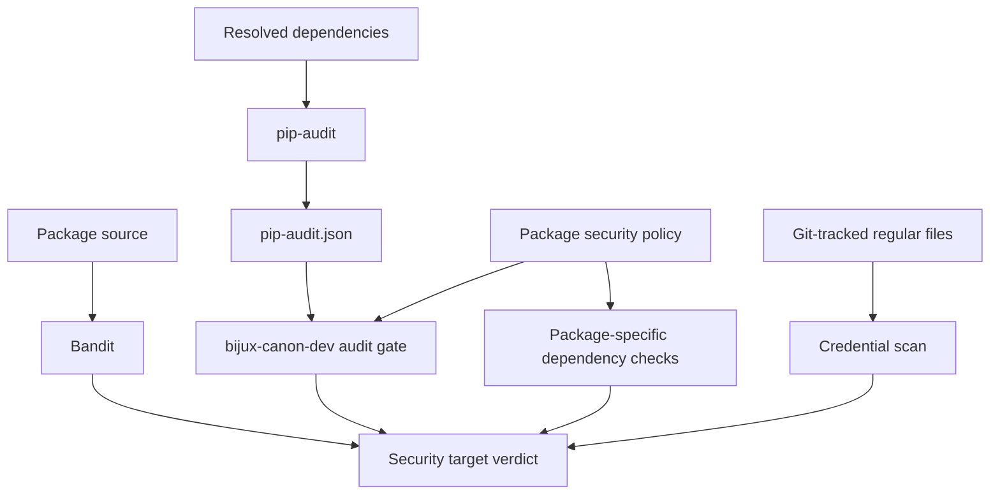
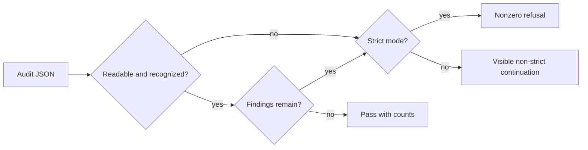

# Security Gates

The shared `security` target combines Python static analysis, dependency
vulnerability auditing, optional package-specific dependency checks, and one
repository-wide scan of tracked source for high-confidence credential material.
`bijux-canon-dev` owns normalization of the pip-audit report; Make owns tool
execution and artifact paths; package profiles own explicit exceptions and
additional checks.

## Gate Composition

| Target | Input | Output beneath `artifacts/<package>/security/` |
| --- | --- | --- |
| `security-bandit` | configured Python source paths | `bandit.json`, `bandit.txt`, isolated bytecode cache |
| `security-audit` | active environment or prepared requirements | `pip-audit.json`, `pip-audit.txt`, optional requirements file |
| `security-deps` | package-specific helper targets | adapter-specific reports or refusal |
| root credential scan | Git-tracked regular files | `artifacts/root/security/secret-scan.json` |
| `security` | all four surfaces | combined exit status |

Bandit excludes generated build, artifact, tox, mypy, and pytest-cache paths by
default. High-severity, high-confidence findings are mandatory and fatal.
`SKIP_BANDIT` and rule-ID skip lists are rejected instead of being treated as
successful analysis.

## Dependency Audit Policy

The audit path produces machine-readable JSON and a human-readable report.
When the repository helper is configured, `security.pip_audit_gate` accepts
either pip-audit’s list form or its dependency-envelope form and evaluates
every vulnerability.

The repository does not admit vulnerability-ignore IDs. Package profiles and
direct gate invocations reject them before interpreting a report. Resolve an
advisory by updating or removing the dependency; a future exception mechanism
must first provide checked-in owner, reason, exact scope, and expiry metadata.

## Strict and Non-Strict Behavior

`SECURITY_STRICT=1` is mandatory:

- a Bandit refusal fails its target;
- a missing, malformed, or unexpected audit report exits with configuration
  failure;
- vulnerabilities fail the audit target;
- a pip-audit invocation failure remains nonzero.

The Make target rejects non-strict mode. Direct use of the report interpreter
may remain useful for diagnosis, but it is not an admissible security result.

The combined target preserves the tool’s nonzero status. Wrappers must not
append unconditional success, discard the report, or treat an absent JSON file
as an empty vulnerability set.

## Tracked-source credential scan

After every package gate succeeds, `bijux-canon-secret-scan` enumerates files
from Git rather than walking the worktree. It scans tracked regular text files,
records every scanned file's SHA-256 identity, and reports only finding type,
path, and line number. Potential secret values are never copied into evidence.
Binary files are identified by a NUL-byte preflight and listed as skipped.

The initial high-confidence signatures cover AWS access-key identifiers,
GitHub classic and fine-grained tokens, OpenAI API keys, and private-key PEM
headers. Any finding is fatal. Enumeration failures, unreadable files,
non-regular tracked paths, and report-write failures are configuration errors;
the scanner does not reinterpret them as a clean result. This repository scan
complements deployment-system secret detection and credential rotation; it
does not claim to discover every possible secret format.

## Investigation Order

| Symptom | Inspect first | Normal response |
| --- | --- | --- |
| Bandit finding | rule ID, source line, JSON confidence/severity | correct the code; required findings cannot be suppressed |
| audit vulnerability | package, installed version, all IDs/aliases, fix versions | update dependency and lock; assess consumers |
| unreadable report | pip-audit invocation and `pip-audit.json` | repair tool/environment; do not classify as clean |
| audit invocation code greater than one | `pip-audit.txt`, environment, index access | treat as tooling failure rather than vulnerability verdict |
| package dependency refusal | package adapter report | correct the package’s declared boundary |

Retain both JSON and text artifacts. JSON supports deterministic processing;
text records the operator-facing interpretation and invocation failure.

## Scope of the Claim

These gates establish static Python findings and known vulnerabilities in the
audited dependency resolution under the checked-in policy. They do not by
themselves prove:

- runtime isolation, authorization, or tenant separation;
- safe handling of every external tool or model response;
- absence of leaked secrets in deployment systems;
- container, host, or network hardening;
- exploitability or non-exploitability of an ignored advisory.

Product packages document their own threat boundaries and runtime controls.
Deployment systems remain responsible for credentials, network policy,
sandboxing, patch cadence, and incident response.

See [Quality Gates](quality-gates.md) for evidence selection,
[SBOM and Supply Chain](sbom-and-supply-chain.md) for dependency inventory, and
the package security guide for product-specific controls.
