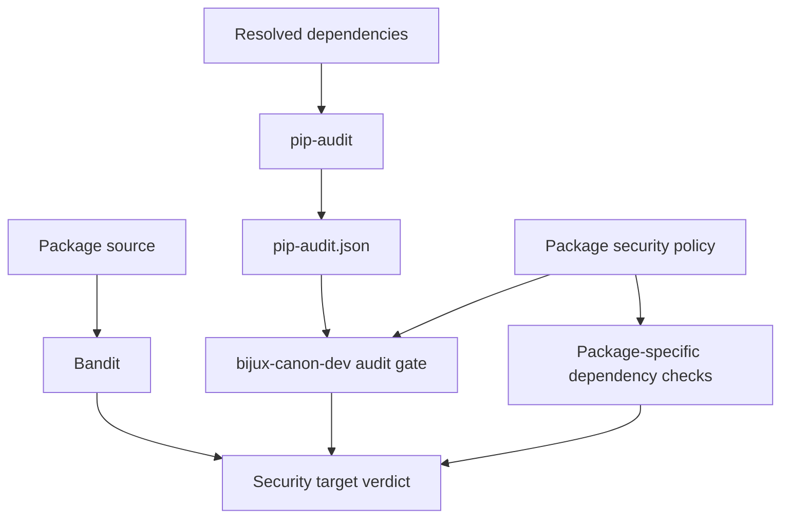
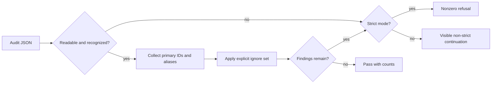

# Security Gates

The shared `security` target combines Python static analysis, dependency
vulnerability auditing, and optional package-specific dependency checks.
`bijux-canon-dev` owns normalization of the pip-audit report; Make owns tool
execution and artifact paths; package profiles own explicit exceptions and
additional checks.

## Gate Composition

| Target | Input | Output beneath `artifacts/<package>/security/` |
| --- | --- | --- |
| `security-bandit` | configured Python source paths | `bandit.json`, `bandit.txt`, isolated bytecode cache |
| `security-audit` | active environment or prepared requirements | `pip-audit.json`, `pip-audit.txt`, optional requirements file |
| `security-deps` | package-specific helper targets | adapter-specific reports or refusal |
| `security` | all three surfaces | combined exit status |

Bandit excludes generated build, artifact, tox, mypy, and pytest-cache paths by
default. A package can add explicit Bandit skip IDs or flags. `SKIP_BANDIT=1`
is visible in the text artifact; it means the analysis was skipped, not passed.

## Dependency Audit Policy

The audit path produces machine-readable JSON and a human-readable report.
When the repository helper is configured, `security.pip_audit_gate` accepts
either pip-audit’s list form or its dependency-envelope form and evaluates
every vulnerability.

Ignore matching checks both the vulnerability’s primary ID and aliases. The
text report states which IDs are ignored and how many vulnerability instances
matched. An ignore entry suppresses the gate finding; it does not patch the
dependency or establish that the advisory is irrelevant.

Package profiles can carry different ignore sets because their resolved
dependency graphs differ. Every exception remains checked-in, reviewable, and
specific. Add an exception only with a documented applicability decision and a
removal trigger; do not broaden it to make unrelated packages green.

## Strict and Non-Strict Behavior

`SECURITY_STRICT=1` is the default. In strict mode:

- a Bandit refusal fails its target;
- a missing, malformed, or unexpected audit report exits with configuration
  failure;
- unignored vulnerabilities fail the audit target;
- a pip-audit invocation failure remains nonzero.

Non-strict mode keeps findings and invocation problems visible but allows the
target to continue. It is appropriate only for an explicitly informational
run and must never be reported as equivalent to strict verification.

The combined target preserves the tool’s nonzero status. Wrappers must not
append unconditional success, discard the report, or treat an absent JSON file
as an empty vulnerability set.

## Investigation Order

| Symptom | Inspect first | Normal response |
| --- | --- | --- |
| Bandit finding | rule ID, source line, JSON confidence/severity | correct code or add the narrowest reviewed suppression |
| audit vulnerability | package, installed version, all IDs/aliases, fix versions | update dependency and lock; assess consumers |
| ignored finding | checked-in package ignore set and advisory status | verify applicability and removal condition |
| unreadable report | pip-audit invocation and `pip-audit.json` | repair tool/environment; do not classify as clean |
| audit invocation code greater than one | `pip-audit.txt`, environment, index access | treat as tooling failure rather than vulnerability verdict |
| package dependency refusal | package adapter report | correct the package’s declared boundary |

Retain both JSON and text artifacts. JSON supports deterministic processing;
text records the operator-facing interpretation and invocation failure.

## Scope of the Claim

These gates establish static Python findings and known vulnerabilities in the
audited dependency resolution under the checked-in policy. They do not by
themselves prove:

- runtime isolation, authorization, or tenant separation;
- safe handling of every external tool or model response;
- absence of leaked secrets in deployment systems;
- container, host, or network hardening;
- exploitability or non-exploitability of an ignored advisory.

Product packages document their own threat boundaries and runtime controls.
Deployment systems remain responsible for credentials, network policy,
sandboxing, patch cadence, and incident response.

See [Quality Gates](quality-gates.md) for evidence selection,
[SBOM and Supply Chain](sbom-and-supply-chain.md) for dependency inventory, and
the package security guide for product-specific controls.
