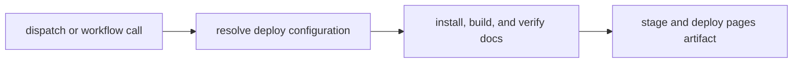

# deploy-docs

`deploy-docs.yml` is the workflow that turns the checked-in handbook into the
published site. In this repository documentation is a maintained public surface,
so the deployment path is part of the contract rather than an afterthought.

## Deployment Flow

This page should make docs deployment feel like a governed publication path,
not a hidden CI side effect. Readers should be able to name the steps from
checked-in handbook to published site.

## Deployment Contract

The workflow resolves docs deploy configuration, sets up the required toolchain,
runs the repository docs install and build commands, verifies the resulting
site, then stages and deploys the Pages artifact.

## Trigger Surface

`deploy-docs.yml` supports manual dispatch and workflow calls. The checked-in
workflow also guards against accidental deploy expectations from the wrong ref
and derives repository-specific site settings from repository configuration.

## First Proof Check

- `.github/workflows/deploy-docs.yml`
- `mkdocs.yml` and `mkdocs.shared.yml`
- `docs/` as the published source tree

## Design Pressure

Docs deployment becomes risky when publishing steps are treated as incidental
build glue. The workflow has to keep configuration, build, verification, and
publication visible as one contract.
