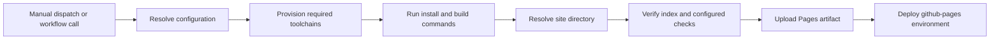

# Documentation Deployment

`deploy-docs.yml` converts the checked-in handbook into a GitHub Pages artifact
and deploys that exact artifact. The workflow keeps toolchain discovery, build,
verification, artifact selection, permissions, and the Pages environment in one
visible custody chain.

```mermaid
flowchart LR
    T[Manual dispatch or workflow call] --> C[Resolve configuration]
    C --> S[Provision required toolchains]
    S --> B[Run install and build commands]
    B --> R[Resolve site directory]
    R --> V[Verify index and configured checks]
    V --> U[Upload Pages artifact]
    U --> D[Deploy github-pages environment]
```

## Trigger and permission boundary

The workflow supports `workflow_dispatch` and `workflow_call`. It grants
`contents: read`, `pages: write`, and `id-token: write`; the deploy job targets
the protected `github-pages` environment and reports the deployed URL.
Concurrency is scoped to the ref, with stale runs cancelled.

A manual run must originate from `main`, `master`, or a `v*` tag. A reusable
workflow call may deploy from its caller context. The deploy job otherwise
requires an allowed branch or tag and a successfully resolved site artifact.

## Configuration precedence

Deploy settings may come from explicit environment, repository variables, or
`.github/docs-deploy.env`, with built-in defaults last. The resolver determines:

- public site URL and expected site directory;
- install, build, and verification commands;
- Python, Node.js, and Rust versions; and
- whether Python, uv, Node.js, or Rust setup is required.

When commands are not configured, the workflow discovers known Make targets.
It refuses the run if no docs build command can be found. Toolchain detection
uses checked-in project files; it does not install every ecosystem
unconditionally.

## Build and artifact resolution

The configured build receives the public site URL. If no recognizable site is
produced and the repository has MkDocs plus a `docs` target, the workflow makes
one explicit fallback attempt. It then searches the configured directory and a
small set of governed artifact locations.

The selected directory must exist and contain `index.html`. An optional verify
command runs against that exact directory. The Pages bundle is validated again
before `actions/upload-pages-artifact` receives it.

| State | Meaning |
| --- | --- |
| docs build command passed | the configured generator completed |
| site directory resolved | one candidate contains a publishable index |
| verify command passed | repository-specific site checks accepted that candidate |
| Pages artifact uploaded | immutable deploy input exists for this run |
| deploy job passed | GitHub Pages accepted and deployed that artifact |

## Failure interpretation

| Failure | Inspect |
| --- | --- |
| no build command | repository variables, deploy environment, and root Make help |
| no `index.html` | configured output directory and actual MkDocs destination |
| verification failure | `DOCS_SITE_DIR`, generated links, assets, and public URL |
| build passes but deploy skips | trigger type, ref, and build output flag |
| deployment denied | Pages environment and workflow permissions |

## Managed-source boundary

The workflow is a synchronized consumer of the shared `bijux-std` deployment
contract. Repository documentation, MkDocs configuration, and supported deploy
configuration remain local. Changes to workflow mechanics belong upstream;
changes to handbook content and repository-specific build behavior belong here.

The published site is supported only when its source commit, build command,
selected directory, uploaded Pages artifact, and deployment result refer to the
same workflow run.
