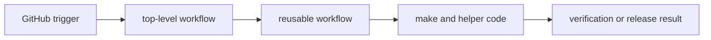

# gh-workflows

The workflow handbook covers the GitHub Actions surfaces that verify, publish,
and deploy this repository. These files are part of the checked-in operational
contract, even when some of them are standards-managed and generated.

The useful question here is not how Actions works in general. The useful
question is which workflow owns a trigger, which reusable file carries shared
execution logic, and where that behavior connects back to checked-in make or
helper code.

## Workflow Model

The workflow handbook should explain ownership, not just list YAML files. A
reader needs to see how a trigger lands in a top-level workflow, where shared
job logic is reused, and which checked-in command surface actually performs the
real work.

## Workflow Pages

- [verify](https://bijux.io/bijux-canon/07-bijux-canon-maintain/gh-workflows/verify/)
- [reusable-workflows](https://bijux.io/bijux-canon/07-bijux-canon-maintain/gh-workflows/reusable-workflows/)
- [deploy-docs](https://bijux.io/bijux-canon/07-bijux-canon-maintain/gh-workflows/deploy-docs/)
- [release-workflows](https://bijux.io/bijux-canon/07-bijux-canon-maintain/gh-workflows/release-workflows/)

## Start With

- Open [verify](https://bijux.io/bijux-canon/07-bijux-canon-maintain/gh-workflows/verify/) for day-to-day repository verification.
- Open [deploy-docs](https://bijux.io/bijux-canon/07-bijux-canon-maintain/gh-workflows/deploy-docs/) for handbook publication.
- Open [release-workflows](https://bijux.io/bijux-canon/07-bijux-canon-maintain/gh-workflows/release-workflows/) for tag-driven release publication.
- Open [reusable-workflows](https://bijux.io/bijux-canon/07-bijux-canon-maintain/gh-workflows/reusable-workflows/) when the question is about the shared
  job contracts called by top-level workflows.

## Checked-In Truth

- `.github/workflows/verify.yml`
- `.github/workflows/deploy-docs.yml`
- `.github/workflows/release-artifacts.yml`
- `.github/workflows/release-github.yml`
- `.github/workflows/release-pypi.yml`
- `.github/workflows/release-ghcr.yml`
- `.github/workflows/ci.yml`

## Boundary

Workflow documentation should explain triggers, callers, and job ownership. It
should not absorb the deeper product behavior that workflows happen to invoke.

## Design Pressure

If a workflow can only be understood by reading raw job YAML without knowing
where execution is delegated, the page is still too shallow. This section has
to keep triggers, reuse, and command ownership visibly connected.
