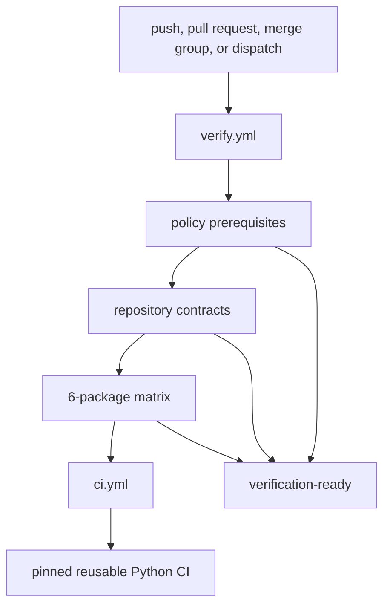

# GitHub Workflows

GitHub Actions supplies event routing, permissions, concurrency, reusable job
composition, and hosted artifacts. The workflow layer does not redefine package
behavior: it invokes checked-in repository commands or pinned reusable
workflows and retains their verdicts.

## Verification Graph

```mermaid
flowchart TD
    event["push, pull request, merge group, or dispatch"]
    verify["verify.yml"]
    policy["policy prerequisites"]
    repository["repository contracts"]
    matrix["6-package matrix"]
    ci["ci.yml"]
    upstream["pinned reusable Python CI"]
    ready["verification-ready"]

    event --> verify --> policy --> repository --> matrix --> ci --> upstream
    policy --> ready
    repository --> ready
    matrix --> ready
```

`verify.yml` runs on relevant changes to `main`, pull requests to `main`, merge
groups, and manual dispatch. Its repository job checks shared Make drift,
configuration layout, Make layout, and generated help. The package job fans out
over runtime, agent, ingest, reason, index, and the internal dev package through
local `ci.yml`; that workflow delegates execution to an exact commit of the
shared Python-package workflow. `verification-ready` requires both repository
and matrix success.

## Workflow Inventory

| Workflow | Trigger or caller | Permission boundary | Result |
| --- | --- | --- | --- |
| `verify.yml` | selected pushes and pull requests, merge groups, manual dispatch | read repository, actions, and pull requests | repository and package verification verdict |
| `ci.yml` | reusable `workflow_call` from verification | read repository | one package's pinned shared CI execution |
| `bijux-std.yml` | pull requests, selected pushes, manual dispatch | read repository | standards drift verdict |
| `github-policy.yml` | pushes, tags, pull requests, merge groups | read repository, actions, pull requests | generated-file, checksum, action-pin, and policy verdicts |
| `pr-approval-policy.yml` | pull-request target and review events | read repository and pull requests | owner review or `owner-self-signoff` enforcement |
| `automerge-pr.yml` | pull-request events | write pull requests; read repository and actions | guarded auto-merge enablement |
| `deploy-docs.yml` | manual dispatch or reusable call | Pages and identity-token write; repository read | built Pages artifact and deployment |
| `release-artifacts.yml` | reusable call | repository read | staged package release artifacts |
| `release-pypi.yml` | manual dispatch or reusable call | repository and actions read; publication authentication is job-scoped | PyPI publication verdict |
| `release-ghcr.yml` | manual dispatch or reusable call | package write; repository and actions read | GHCR package publication |
| `release-github.yml` | manual dispatch or reusable call | repository-content write; actions read | GitHub Release and attached assets |

The release workflows do not run merely because a tag exists in this
repository. They require a manual or reusable caller and resolve an explicit
release configuration before building or publishing. A release claim should
therefore identify the workflow run and selected tag, not infer publication
from tag presence alone.

## Documentation Deployment

`deploy-docs.yml` resolves install, build, and verification commands from
repository configuration and available Make targets. For this repository the
preferred build path reaches `docs-check`; the workflow packages the resulting
site for GitHub Pages and deploys it in a separate job. A successful local
MkDocs build proves site construction, while the deploy job proves Pages
permissions and hosting behavior.

## Managed And Repository-Owned Files

Most policy, CI, documentation deployment, and release workflows are synchronized
consumer copies whose headers name their upstream source. Repository-specific
behavior belongs in supported configuration, Make profiles, or the upstream
standard rather than an untracked local fork. `bijux-std.yml` verifies that
relationship, and `github-policy.yml` checks generated files and the shared
checksum manifest.

## Read A Workflow Run

1. identify the event and top-level workflow;
2. inspect path filters, inputs, concurrency, and permissions;
3. follow local and remote `uses:` edges to the job that executes;
4. find the Make target or helper that owns the decision;
5. inspect the retained artifact, publication, or terminal verdict;
6. distinguish skipped, refused, failed, and successful jobs.

A green reusable job does not grant permissions beyond its caller. A skipped
package matrix is not a passing package matrix. A successful build is not a
publication unless the channel-specific publish job also succeeded.

## Continue By Workflow Family

- [Verify](verify.md) covers repository and package verification.
- [Reusable workflows](reusable-workflows.md) covers local and pinned shared
  calls.
- [Deploy docs](deploy-docs.md) covers Pages build and deployment.
- [Release workflows](release-workflows.md) covers staged artifacts and the
  PyPI, GHCR, and GitHub channels.
