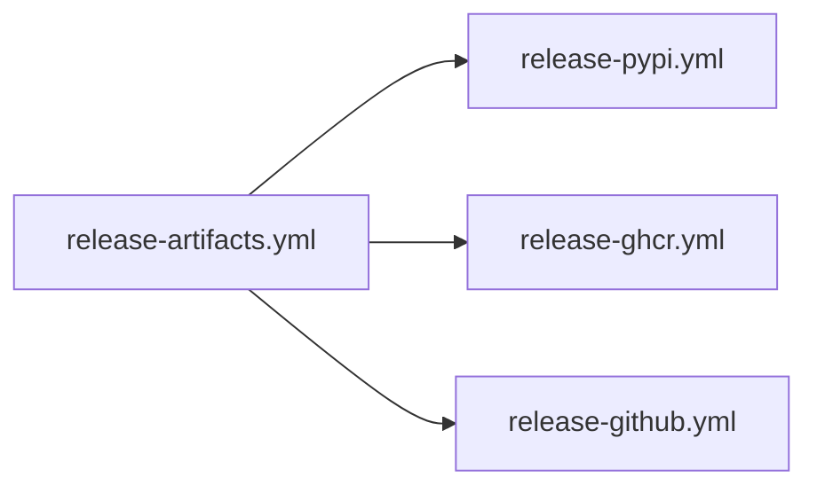

# release-workflows

Release publication is split across a coordinator and several publication
workflows so each surface stays explicit. The repository does not treat release
as one opaque job.

## Publication Flow

This page should let a reader see the release split at a glance: one artifact
build step, then specialized publication surfaces that stay reviewable on their
own.

## Publication Workflows

- `.github/workflows/release-artifacts.yml` builds and stages release artifacts
- `.github/workflows/release-pypi.yml` publishes package distributions to PyPI
- `.github/workflows/release-ghcr.yml` publishes GHCR release bundles
- `.github/workflows/release-github.yml` publishes GitHub Release output

## Job Split

The coordinator builds artifacts first, then hands publication to the
specialized workflows. That split keeps artifact creation, package publication,
container publication, and GitHub release publication reviewable as separate
surfaces.

## First Proof Check

- `.github/workflows/release-artifacts.yml`
- `.github/workflows/release-pypi.yml`
- `.github/workflows/release-ghcr.yml`
- `.github/workflows/release-github.yml`
- supporting helpers in `packages/bijux-canon-dev/src/bijux_canon_dev/release`

## Design Pressure

Release automation turns into folklore when artifact creation and publication
destinations blur together. The split has to stay explicit enough that each
publication path can be reviewed without reading the whole release stack first.
