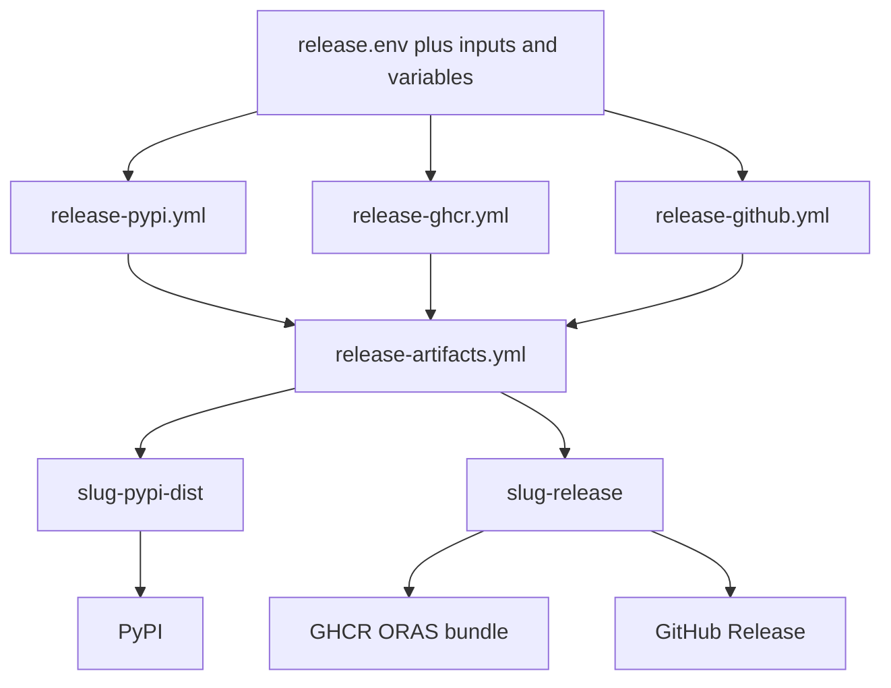

# Release Workflows

Release publication has three destination workflows and one reusable artifact
builder. There is no repository-local all-destinations coordinator: PyPI, GHCR,
and GitHub Release each resolve their configuration, build the selected package
matrix through `release-artifacts.yml`, and publish to one destination.

```mermaid
flowchart TD
    E[release.env plus inputs and variables] --> PY[release-pypi.yml]
    E --> GH[release-ghcr.yml]
    E --> GR[release-github.yml]
    PY --> A[release-artifacts.yml]
    GH --> A
    GR --> A
    A --> PD[slug-pypi-dist]
    A --> RA[slug-release]
    PD --> P[PyPI]
    RA --> O[GHCR ORAS bundle]
    RA --> R[GitHub Release]
```

## Shared package matrix

`.github/release.env` enables release surfaces and declares build records for
canonical distributions and compatibility distributions. Each record names the
package directory, artifact directory, profile when nonstandard, build targets,
and any distribution-subdirectory override. Publisher matrices identify which
of the staged packages go to each destination.

All three destination workflows support manual dispatch and reusable calls.
They normalize inputs, repository variables, and release environment values;
validate matrix JSON; and refuse a manual dispatch that resolves to a no-op.
Enabled release tags must begin with `v` where a tag is required.

## Destination contracts

| Workflow | Input artifact | Publication contract | Write permission |
| --- | --- | --- | --- |
| `release-pypi.yml` | `<slug>-pypi-dist` | trusted publishing by default, guarded token bootstrap when configured, or a dedicated Maturin mode | `id-token: write` in artifact publication job |
| `release-ghcr.yml` | `<slug>-release` | tar the staged bundle and push it with ORAS annotations; add `latest` only for allowed non-prereleases | `packages: write` |
| `release-github.yml` | matching `*-release` artifacts | download assets from the same run and create or update a named GitHub Release | `contents: write` |

Concurrency is scoped by ref and does not cancel in-progress publication. A
newly started release must not invalidate custody of an existing candidate.

## PyPI refusal behavior

Artifact mode first builds and downloads the named distribution artifact.
Trusted publishing is attempted unless token mode is selected. If trusted
publishing fails, token bootstrap is permitted only when configured, the PyPI
project probe says the project is missing, and a token exists. An indeterminate
probe refuses fallback. The workflow fails when neither authenticated path
succeeds.

This distinction prevents a network error or permission problem from silently
changing authentication strategy.

## GHCR bundle semantics

GHCR publication archives the complete staged release directory, including
normalized SBOM assets when generated. It publishes an OCI artifact with title,
version, source, and commit-revision annotations. The `latest` tag is optional
and is never assigned to a prerelease version.

The GHCR object is a release bundle, not a claim that the package is an
executable container image.

## GitHub Release custody

The GitHub workflow may wait for a configured CI gate and run repository-
specific planning or preparation commands. It downloads artifacts from its own
run by pattern, resolves the tag and release name, and publishes files with
optional checked-in release notes. Deleting an existing release is disabled by
default and must be explicitly enabled.

## Evidence and limitations

The reusable builder validates that publishable distributions exist and stages
SBOM files when available. It does not run strict `sbom-validate` unless that
target is included in the configured build target string. Registry acceptance
also does not prove a downstream installation; use the destination-specific
post-publication contract when one is configured.

These workflows are synchronized shared-standard consumers. Destination logic
changes belong in `bijux-std`; repository package matrices and supported
configuration values are the local integration surface. A release claim must
name the destination workflow, source SHA, tag, package artifact, and successful
publication job.
