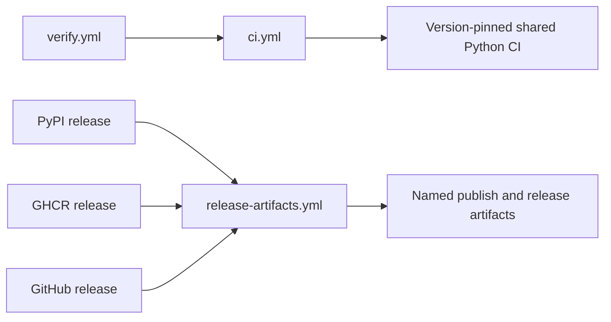

# Reusable Workflow Contracts

Reusable workflows separate caller intent from shared job execution. A caller
owns the trigger, package matrix, and required result; the called workflow owns
the validated input shape, permissions, concurrency, runner setup, local command
invocation, and artifact handoff.

## Package verification contract

`.github/workflows/verify.yml` supplies a matrix entry for every canonical
product package and `bijux-canon-dev`. Each entry calls `ci.yml` with:

- package slug, directory, and artifact directory;
- a JSON Python-version list;
- a JSON check-target list;
- API toolchain targets; and
- an optional post-test command.

`ci.yml` grants read-only contents access, cancels superseded work for the same
package and ref, and delegates to the shared Python package workflow at an exact
`bijux-std` commit. Dependabot pull requests are excluded at this layer. The
caller retains the final gate: `verification-ready` requires the repository and
package matrix results to be successful.

## Release artifact contract

`release-artifacts.yml` accepts a package slug, package directory, artifact
directory, optional profile path, build-target string, and distribution
subdirectory. It then:

1. checks out the exact workflow commit with full history;
2. provisions Python 3.11 and uv;
3. resolves an absolute package profile path;
4. runs profile installation and each requested build target;
5. refuses a distribution tree without a wheel or source archive;
6. stages PyPI distributions separately from expanded release assets; and
7. uploads `<slug>-pypi-dist` and `<slug>-release` for 14 days.

Release assets include all distribution-directory files and, when present,
normalized production SBOM, development SBOM, and SBOM summary names. The
specialized publisher downloads one of these named artifacts; it must not
reconstruct an unnamed candidate.

## Caller and callee ownership

| Concern | Caller | Reusable workflow |
| --- | --- | --- |
| trigger and release intent | owns | does not infer |
| package matrix | supplies | validates and executes |
| target selection | supplies bounded inputs | invokes supplied targets |
| credentials | grants through job/environment | requests only declared permissions |
| artifact name and retention | consumes contract | produces contract |
| final required status | evaluates | returns job result |

## Security and concurrency

Verification uses read-only contents permission and cancels stale runs. Release
artifact construction is also read-only but does not cancel an in-progress
build; an approved release candidate should not disappear because another run
started. Publication workflows grant `id-token`, `packages`, or `contents`
write only to the destination job that needs it.

## Managed-source boundary

These workflow files are synchronized consumer copies from `bijux-std`. Their
exact content is evidence of what runs in this repository, but durable workflow
changes belong in the shared standards source followed by a governed refresh.
Repository-specific package and release configuration is supplied through the
supported matrices and environment files, not by patching generated copies.

A reusable workflow is trustworthy when its inputs, permissions, called
commands, outputs, and caller gate can all be followed without relying on an
Actions log from an earlier run.
