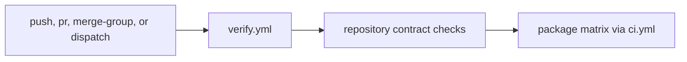

# verify

`verify.yml` is the main repository verification workflow. It is the broadest
day-to-day CI truth because it checks shared repository contracts first, then
fans out across the package matrix through reusable workflows.

## Workflow Model

This page should make the verification path obvious: shared repository truth is
checked first, then package-scoped proof fans out through the reusable CI
contract.

## Entry Workflow

`verify.yml` runs on pushes, pull requests, manual dispatch, and merge-group
validation for changes touching repository code, docs, workflows, packages,
make surfaces, or tracked configuration files.

## Job Shape

- `repository` checks shared automation contracts first
- `package` fans out by package and delegates to `.github/workflows/ci.yml`
- package jobs carry package-scoped `tests`, `checks`, and `lint` work

## First Proof Check

- `.github/workflows/verify.yml`
- `.github/workflows/ci.yml`
- repository and CI targets under `makes/`

## Design Pressure

Verification gets harder to trust when repository checks and package checks are
mixed without a visible order. The main workflow has to keep the shared-first,
package-second structure easy to name.
