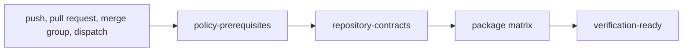

# Repository Verification Workflow

`.github/workflows/verify.yml` is the required repository verification graph.
It gates package work behind policy prerequisites and shared repository
contracts, then delegates package checks through one reusable workflow.


```mermaid
flowchart LR
    event["push, pull request, merge group, dispatch"]
    policy["policy-prerequisites"]
    repo["repository-contracts"]
    matrix["package matrix"]
    ready["verification-ready"]

    event --> policy --> repo --> matrix --> ready
```

## Trigger Contract

The workflow runs for `main` pushes and pull requests that change repository
policy, workflows, APIs, configs, docs, make logic, packages, or root build
configuration. It also supports manual dispatch and merge-queue validation.

Concurrency is keyed by Git reference, and a newer run cancels an older run for
the same reference. Repository permissions are read-only.

## Gate Order

### Policy prerequisites

`policy-prerequisites` runs `.github/scripts/check_workflow_prerequisites.py`.
It prevents repository verification from proceeding before required policy and
standards checks have reached their expected state.

### Repository contracts

`repository-contracts` runs only after the policy gate. It verifies:

```text
make check-shared-bijux-py check-config-layout check-make-layout help
```

These checks cover synchronized make standards, required configuration layout,
required make entrypoints, and the public help surface. They do not substitute
for package tests.

### Package matrix

The matrix covers the five runtime packages plus `bijux-canon-dev`. Each entry
passes package directory and artifact directory to `.github/workflows/ci.yml`,
which delegates to the SHA-pinned reusable Python workflow in `bijux-std`.

Default package checks are `quality`, `security`, `docs`, `api`, `build`, and
`sbom`. Notable exceptions are explicit in the matrix:

- runtime also runs `openapi-drift` and post-test coverage thresholds for
  selected boundaries when those files exist;
- ingest tests Python 3.11, 3.12, and 3.13; and
- the development package omits docs and API checks from its package targets.

Matrix jobs do not fail fast, so one package failure does not hide evidence from
the others.

### Completion gate

`verification-ready` always evaluates after repository and package jobs. It
succeeds only when both job groups report success. This gives branch protection
one stable terminal check without discarding the package-level failure detail.

## Reading a Failure

Start with the earliest failed gate:

| Failed job | Investigate first |
| --- | --- |
| `policy-prerequisites` | prerequisite workflow state and GitHub policy visibility |
| `repository-contracts` | synchronized standards, config tree, or make layout |
| package matrix entry | that package's delegated check and artifact directory |
| `verification-ready` only | dependency result propagation or cancellation state |

Package artifacts are written under the matrix entry's `artifacts/<package>`
directory. Use those logs before rerunning a broad lane; they identify the
specific check family that failed.

## Change Ownership

Both workflow files are synchronized from `bijux-std` and carry a generated
source-of-truth notice. Change reusable behavior upstream, then refresh the
managed copy and checksum through the standards synchronization process. Local
package behavior belongs in package make profiles or repository-owned check
configuration, not in a hand-edited generated workflow.

See [CI Targets](../makes/ci-targets.md) for the local command families used
by delegated checks.
