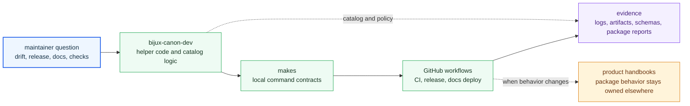

# Maintenance Handbook

The maintenance handbook covers repository-health surfaces that sit above any
single product package. It exists so schema drift checks, shared command
surfaces, publication workflows, and maintainer-only helpers can be reviewed
from checked-in truth instead of CI archaeology.

These pages are narrow by design. They document repository operation, not
product semantics. If a change alters ingest, index, reasoning, agent, or
runtime behavior for users, the owning package handbook still owns the real
explanation.

## Maintenance System

Maintenance work should be easy to audit because each automation surface has a
checked-in owner. The helper package provides repository-health logic, `makes/`
turns that logic into repeatable local commands, and GitHub workflows run the
same contract in CI and release paths.

## Handbook Sections

- [bijux-canon-dev](https://bijux.io/bijux-canon/07-bijux-canon-maintain/bijux-canon-dev/) for repository-health helper code,
  schema governance, release support, quality gates, and supply-chain tooling
- [makes](https://bijux.io/bijux-canon/07-bijux-canon-maintain/makes/) for the shared `make` interface,
  package dispatch, CI target families, and release-facing command surfaces
- [gh-workflows](https://bijux.io/bijux-canon/07-bijux-canon-maintain/gh-workflows/) for GitHub Actions entrypoints,
  reusable workflow contracts, release publication, and docs deployment

## Start With

- Open [bijux-canon-dev](https://bijux.io/bijux-canon/07-bijux-canon-maintain/bijux-canon-dev/) when the question is which helper code or test
  owns a repository-health rule.
- Open [makes](https://bijux.io/bijux-canon/07-bijux-canon-maintain/makes/) when the concern begins at `Makefile`, shared targets, or package
  dispatch.
- Open [gh-workflows](https://bijux.io/bijux-canon/07-bijux-canon-maintain/gh-workflows/) when the concern begins in GitHub Actions triggers, job
  graphs, or publication orchestration.

## Proof Path

- `packages/bijux-canon-dev/` is the maintainer helper package.
- `makes/` is the checked-in command surface.
- `.github/workflows/` is the checked-in workflow contract.
- `artifacts/` is the default destination for local check output and generated run products.

## Boundary

Maintainer documentation can explain repository health, but it should never act
as a shortcut for product behavior. When a maintainer surface only wraps a
product package contract, this handbook should stop at the integration point
and send the reader back to the owning package.
