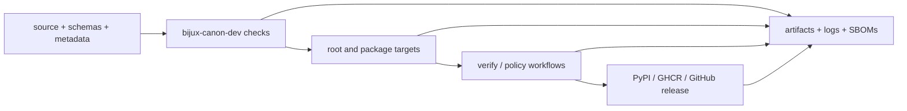
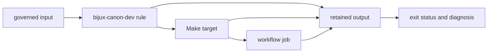

# Maintenance Handbook

Repository maintenance is implemented as a three-layer control system:
`bijux-canon-dev` owns repository-specific checks, `makes/` exposes repeatable
local commands and package dispatch, and GitHub workflows apply those commands
to pull requests, documentation deployment, and tagged publication.

## Maintenance System

```mermaid
flowchart LR
    source["source + schemas + metadata"]
    dev["bijux-canon-dev checks"]
    make["root and package targets"]
    verify["verify / policy workflows"]
    release["PyPI / GHCR / GitHub release"]
    evidence["artifacts + logs + SBOMs"]

    source --> dev --> make --> verify --> release
    dev --> evidence
    make --> evidence
    verify --> evidence
    release --> evidence
```

## Command Families

| Intent | Local command | Primary evidence |
| --- | --- | --- |
| full verification with lock consistency | `make check` | lock, package-specific test, lint, quality, security, docs, API, build, and SBOM output |
| full repository surfaces without the lock precondition | `make all` | package-specific test, lint, quality, security, docs, API, build, and SBOM output |
| exhaustive tests | `make test-all` | slow, evaluation, and real-local test results where configured |
| API governance | `make api` | schema lint, generated-schema drift, pins, hashes, and live contract tests |
| documentation | `make docs-check` | strict MkDocs build and hygiene result |
| supply chain | `make security` and `make sbom` | Bandit, dependency audit, CycloneDX documents, validation summary |
| release preparation | package build and publication guards | wheel, sdist, Twine result, resolved version, publication eligibility |

Generated logs, reports, SBOMs, build products, and test output belong under
`artifacts/`. Checked-in API pins and documentation remain in their governed
repository locations because they are versioned contract sources, not local run
products.

## Choose A Check By The Claim

| Claim to establish | Narrow evidence | Broader evidence when needed |
| --- | --- | --- |
| one package still satisfies its local contract | package Make target and retained report | root package matrix for shared dependency changes |
| an HTTP schema is synchronized | schema lint, generated diff, pin and hash validation | live contract tests for implemented routes |
| documentation remains publishable | strict MkDocs build, link and publication contracts | docs deployment job for hosting behavior |
| a dependency change is admissible | lock resolution, policy check, focused package tests | security audit and affected package matrix |
| a package can be released | build, metadata, wheel/sdist validation, publication guard | tagged PyPI, GHCR, and GitHub release workflows |
| a compatibility bridge remains equivalent | alias imports, module identity, command parity | canonical package tests under the tagged version |

Use the narrowest check that exercises the changed contract. Root aggregation
is necessary when shared metadata, dependencies, API governance, or release
membership changed; repeating every expensive lane is not stronger evidence
for a documentation-only edit.

## Start With The Changed Surface

| Changed surface | First command | Escalate when |
| --- | --- | --- |
| reader-facing Markdown or MkDocs navigation | `make docs-check` | a helper, theme contract, generated reference, or deployment behavior also changed |
| one `bijux-canon-dev` helper | its focused test module | the helper is shared by several Make or workflow paths |
| one package's implementation | that package's narrow target or test selection | its public schema, dependency boundary, or downstream handoff changed |
| root package inventory or lock data | `make lock-check` plus inventory contract tests | public release membership or resolution changed |
| one OpenAPI contract | owning package API targets | source, pin, hash, or live implementation disagree |
| workflow trigger, permission, or dependency | workflow contract tests | the invoked command or release output also changed |

Escalation follows affected contracts, not command size. A strict docs build and
the documentation publication tests are stronger evidence for a handbook-only
change than an unrelated model evaluation or real-service lane.

## Read A Failed Check

```mermaid
flowchart LR
    input[governed input]
    helper[bijux-canon-dev rule]
    target[Make target]
    workflow[workflow job]
    artifact[retained output]
    verdict[exit status and diagnosis]

    input --> helper --> target --> workflow
    helper --> artifact
    target --> artifact
    workflow --> artifact
    artifact --> verdict
```

Start at the first layer that made the disputed decision. A helper failure is
not repaired by changing workflow presentation. A missing Make dependency is
not a product-package defect. A workflow permission or trigger error is not
evidence that the underlying check passed or failed.

Retained output belongs under `artifacts/`. A command line without its governed
input, exit status, and diagnostic output is not sufficient evidence of a
maintenance decision.

## Build A Maintenance Evidence Record

For a consequential check or release decision, retain enough context to answer
the full chain:

| Evidence | Question answered |
| --- | --- |
| source commit and dirty-state status | which repository state was evaluated? |
| tool and dependency identity | which implementation interpreted that state? |
| exact command and governed inputs | what decision was requested? |
| structured report, log, or artifact | what observations supported the verdict? |
| exit status and policy result | what did the check decide? |
| workflow run or publication identity | where was the decision enforced or released? |

A green badge is a navigation aid, not this evidence record. Likewise, a local
success cannot be represented as a CI success, and a build artifact cannot be
represented as published until the destination accepted that exact artifact.
The maintenance system earns trust by keeping these identities connected.

## Repository-Specific Checks

`bijux-canon-dev` freezes and compares OpenAPI contracts, synchronizes badge
blocks, validates MkDocs structure, reports index plugin conformance, enforces
runtime dependency allowlists, gates package publication, resolves release
versions, prepares SBOM requirements, and applies the dependency-audit policy.
These helpers are internal support code and are not part of the public product
package set.

## Boundary

Maintainer documentation can explain repository health, but it should never act
as a shortcut for product behavior. When a maintainer surface only wraps a
product package contract, this handbook should stop at the integration point
and send the reader back to the owning package.

## Workflow Boundaries

`verify.yml` is the main verification entrypoint. Separate workflows govern
repository policy, PR approval, docs deployment, and PyPI, GHCR, and GitHub
release publication. A successful docs deployment does not imply package tests
passed; a successful package build does not imply publication guards passed;
and a reusable workflow does not broaden the permissions of its caller.

## Continue By Surface

| Surface | Handbook |
| --- | --- |
| repository-health commands, schema rules, release guards, SBOM and audit helpers | [bijux-canon-dev](bijux-canon-dev/index.md) |
| root targets, package dispatch, environment ownership, CI and release commands | [Make system](makes/index.md) |
| triggers, reusable jobs, permissions, documentation deployment, and publication | [GitHub workflows](gh-workflows/index.md) |
