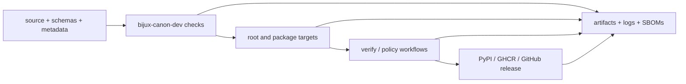

# Maintenance Handbook

Repository maintenance is implemented as a three-layer control system:
`bijux-canon-dev` owns repository-specific checks, `makes/` exposes repeatable
local commands and package dispatch, and GitHub workflows apply those commands
to pull requests, documentation deployment, and tagged publication.

## Maintenance System

```mermaid
flowchart LR
    source["source + schemas + metadata"]
    dev["bijux-canon-dev checks"]
    make["root and package targets"]
    verify["verify / policy workflows"]
    release["PyPI / GHCR / GitHub release"]
    evidence["artifacts + logs + SBOMs"]

    source --> dev --> make --> verify --> release
    dev --> evidence
    make --> evidence
    verify --> evidence
    release --> evidence
```

## Command Families

| Intent | Local command | Primary evidence |
| --- | --- | --- |
| full verification | `make check` or `make all` | package-specific test, lint, quality, security, API, build, and SBOM output |
| exhaustive tests | `make test-all` | slow, evaluation, and real-local test results where configured |
| API governance | `make api` | schema lint, generated-schema drift, pins, hashes, and live contract tests |
| documentation | `make docs-check` | strict MkDocs build and hygiene result |
| supply chain | `make security` and `make sbom` | Bandit, dependency audit, CycloneDX documents, validation summary |
| release preparation | package build and publication guards | wheel, sdist, Twine result, resolved version, publication eligibility |

Generated logs, reports, SBOMs, build products, and test output belong under
`artifacts/`. Checked-in API pins and documentation remain in their governed
repository locations because they are versioned contract sources, not local run
products.

## Verification Path

1. identify the package or shared contract that changed
2. run its narrow package target and inspect the artifact output
3. run the applicable root aggregation target
4. confirm the matching workflow trigger and publication dependency
5. treat a skipped, missing, or stale check as unresolved evidence

## Handbook Sections

- [bijux-canon-dev](https://bijux.io/bijux-canon/07-bijux-canon-maintain/bijux-canon-dev/) for repository-health helper code,
  schema governance, release support, quality gates, and supply-chain tooling
- [makes](https://bijux.io/bijux-canon/07-bijux-canon-maintain/makes/) for the shared `make` interface,
  package dispatch, CI target families, and release-facing command surfaces
- [gh-workflows](https://bijux.io/bijux-canon/07-bijux-canon-maintain/gh-workflows/) for GitHub Actions entrypoints,
  reusable workflow contracts, release publication, and docs deployment

## Start With

- Open [bijux-canon-dev](https://bijux.io/bijux-canon/07-bijux-canon-maintain/bijux-canon-dev/) when the question is which helper code or test
  owns a repository-health rule.
- Open [makes](https://bijux.io/bijux-canon/07-bijux-canon-maintain/makes/) when the concern begins at `Makefile`, shared targets, or package
  dispatch.
- Open [gh-workflows](https://bijux.io/bijux-canon/07-bijux-canon-maintain/gh-workflows/) when the concern begins in GitHub Actions triggers, job
  graphs, or publication orchestration.

## Proof Path

- `packages/bijux-canon-dev/` is the maintainer helper package.
- `makes/` is the checked-in command surface.
- `.github/workflows/` is the checked-in workflow contract.
- `artifacts/` is the default destination for local check output and generated run products.

## Repository-Specific Checks

`bijux-canon-dev` freezes and compares OpenAPI contracts, synchronizes badge
blocks, validates MkDocs structure, reports index plugin conformance, enforces
runtime dependency allowlists, gates package publication, resolves release
versions, prepares SBOM requirements, and applies the dependency-audit policy.
These helpers are internal support code and are not part of the public product
package set.

## Boundary

Maintainer documentation can explain repository health, but it should never act
as a shortcut for product behavior. When a maintainer surface only wraps a
product package contract, this handbook should stop at the integration point
and send the reader back to the owning package.

## Workflow Boundaries

`verify.yml` is the main verification entrypoint. Separate workflows govern
repository policy, PR approval, docs deployment, and PyPI, GHCR, and GitHub
release publication. A successful docs deployment does not imply package tests
passed; a successful package build does not imply publication guards passed;
and a reusable workflow does not broaden the permissions of its caller.
