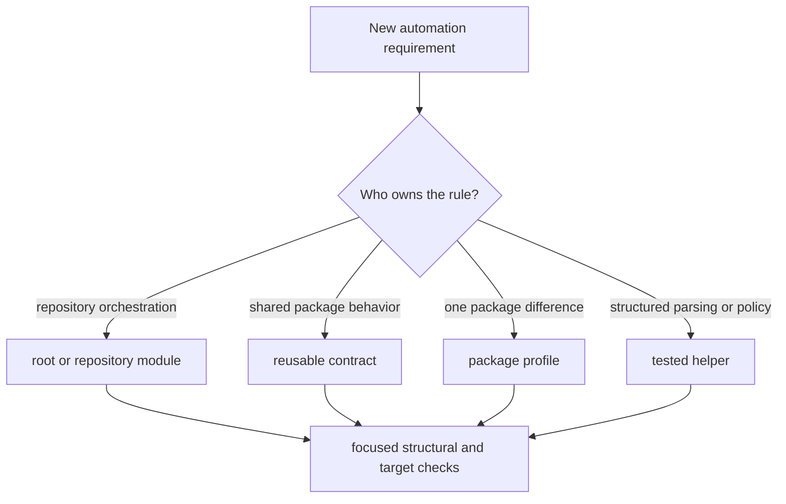

# Authoring Rules

Make changes should preserve a traceable path from public command to reusable
contract, structured helper, and artifact. Choose the narrowest durable owner
before adding a variable, recipe, include, or profile override.



## Select an owner

| Requirement | Owner |
| --- | --- |
| expose or group root commands | `makes/root.mk` or `makes/bijux-py/root/` |
| validate repository layout or configuration | `makes/bijux-py/repository/` |
| implement a target family shared by packages | `makes/bijux-py/ci/` or API contract module |
| set one package's import, paths, modes, or bounded exceptions | `makes/packages/<slug>.mk` |
| parse JSON, YAML, TOML, Markdown, or compare structured state | tested `bijux-canon-dev` module invoked by Make |
| define package membership or compatibility alias | `makes/packages.mk` |

The `ci/` name describes the reusable quality families; these contracts are
also local commands. Do not create separate local and CI implementations.

## Compose targets explicitly

- Define shared behavior once and expose configuration through named variables.
- Keep package profiles declarative; repeated recipes indicate a missing shared
  contract.
- Use prerequisites for genuine dependency order and order-only prerequisites
  for environment setup that should not force rebuild semantics.
- Mark command targets `.PHONY` and include a `##` help description for public
  surfaces.
- Preserve `set -eu` and pipe-failure behavior where a multi-command recipe
  controls acceptance.
- Use recursive Make with the active profile and explicit context rather than
  calling an unowned shell fragment.
- Route generated output, caches, and reports into the active artifact root.

## Keep variables honest

Use `?=` for caller-configurable defaults, `:=` for values that should be
resolved once, and ordinary `=` only when deferred expansion is required.
Prefer positive capability names and narrow switches. A skip variable must be
visible in output and must not make missing proof look like successful proof.

Absolute paths are required across a `-C` boundary. Package profiles derive
their location from the absolute `-f` path supplied by the dispatcher. Direct
profile examples must follow the same rule:

```bash
make -f "$PWD/makes/packages/bijux-canon-agent.mk" \
  -C packages/bijux-canon-agent help
```

## Failure behavior

Acceptance targets fail on missing required inputs, malformed outputs, failed
validation, or unavailable required tools. Best-effort reports must say they
are best effort and remain separate from acceptance targets. Do not append
`|| true` to a gate; if a generator is intentionally tolerant, add a strict
validator and document which target supports an acceptance claim.

## Validate a Make change

1. Run `make check-make-layout` for placement and required entrypoints.
2. Run `make help` and, when inventory changed, `make list-all`.
3. Invoke the narrow affected root or package target.
4. Inspect the generated artifact and failure message.
5. For dispatch changes, exercise a valid slug, an alias if affected, and an
   invalid slug.

Use `make -n` for expansion inspection only; a dry expansion does not prove the
tool, artifact, or refusal behavior.

## Review signals

Reject a change when a package profile contains copied policy, a root target
interprets product data, a workflow becomes the sole implementation, output
escapes `artifacts/`, or the only explanation of a failure is hidden inside a
long shell recipe. Those are ownership failures even if the happy path passes.
