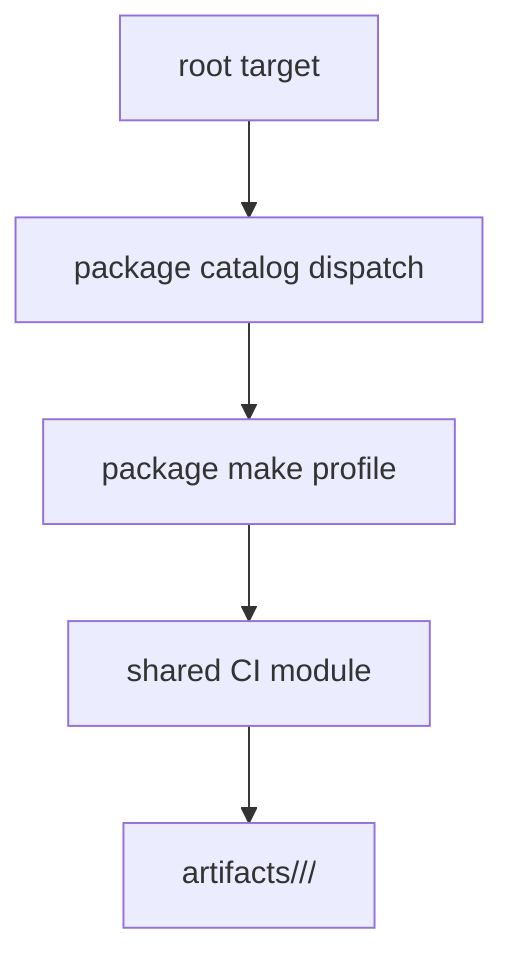

# CI Targets

The make surface is the local entrypoint to the same check families used in CI.
Every generated report, cache, and build product is routed under `artifacts/`
through the package or repository artifact root.

## Choose the Narrowest Target

| Intent | Target | Evidence |
| --- | --- | --- |
| render public docs strictly | `make docs-check` | generated config, staged source, and site under `artifacts/docs/` |
| check docs links during quality | `make docs-links` | package-configured link-check result |
| run primary tests | `make test` | coverage, JUnit, logs, and test state under package artifacts |
| run unit-focused tests | `make test-unit` | unit selection or configured filtered fallback |
| lint one file or directory | `make lint-file file=…`, `make lint-dir dir=…` | focused lint output |
| run package lint | `make lint` | tool logs under the lint artifact directory |
| inspect maintainability | `make quality` | complexity, dead-code, typing, and configured quality logs |
| audit security | `make security` | Bandit and dependency audit reports |
| validate API contracts | `make api` | schema lint, drift, and package API evidence |
| detect OpenAPI drift | `make openapi-drift` | generated-versus-pinned schema comparison |
| build release files | `make build` | wheel, source archive, and Twine report |
| produce dependency inventory | `make sbom` | production/development CycloneDX documents and summary |

Use focused targets while developing. `make check` is the complete repository
flow—lock, lint, test, quality, security, docs, API, build, and SBOM—and is
appropriate for final integration evidence rather than every documentation
edit.

## Target Composition

The root makefile discovers package groups from the package catalog and invokes
the corresponding package profile. Profiles set package-specific paths,
markers, thresholds, API strategy, and optional checks. Shared modules implement
the common tool lifecycle and artifact conventions.

This division means the target name describes intent while the package profile
describes scope. Before reproducing a CI command manually, inspect the package
matrix and its make profile rather than assuming every package runs identical
tools or Python versions.

## Documentation Targets

`docs-check` prepares a generated MkDocs source tree and effective configuration,
runs a strict build, and applies documentation hygiene. It uses an isolated
cache and site directory under repository artifacts. `docs` produces a local
site through the same preparation path. `docs-serve` coordinates a lock and
status file so multiple server processes do not compete for the configured
address.

`docs-hygiene` rejects generated site or cache directories at the repository
root. A successful build with root pollution is therefore still a failed docs
contract.

## Test Scope

`test` is the primary configured suite. `test-unit`, `test-e2e`,
`test-regression`, and `test-evaluation` select owned subsets when the package
defines them. `test-all` removes the default marker restriction, and
`test-all-plus-run-time` additionally reports every duration. Those exhaustive
targets are intentionally separate because they can include slow, evaluation,
and real-local work.

## Build and Supply Chain

`build` creates wheel and source distributions in the artifact directory and
runs Twine validation. Temporary package outputs are removed after the governed
artifacts are retained. `sbom` creates production and development inventories;
`sbom-validate` verifies their CycloneDX structure. Security checks retain both
human-readable and machine-consumable output rather than relying only on a
terminal exit code.

See [Repository Verification Workflow](../gh-workflows/verify.md) for the job
graph that invokes these targets.
