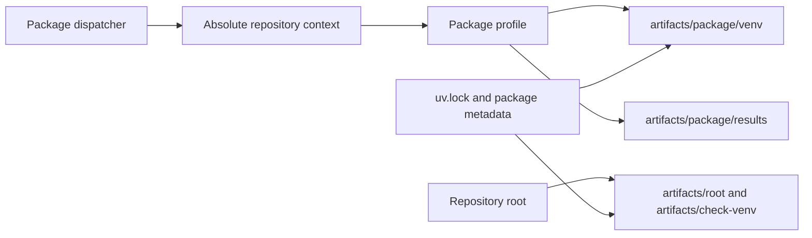

# Environment Model

Repository and package commands use explicit, separate environments. The root
check environment supports documentation and repository helpers; package
profiles use package-scoped environments and artifact roots. The dispatcher
passes absolute context so invocation location cannot silently change inputs or
outputs.



## Environment ownership

| Scope | Environment | Typical consumers |
| --- | --- | --- |
| root lifecycle | `artifacts/root/venv` | repository install and lifecycle targets |
| root checks | `artifacts/check-venv` | MkDocs, repository contracts, and `bijux-canon-dev` helpers |
| package profile | `artifacts/<slug>/venv` | package test, quality, security, API, build, and SBOM targets |

The root `install` target synchronizes from `pyproject.toml` and `uv.lock` with
`uv sync --frozen --group dev`. A frozen sync treats lock drift as an error.
Package profiles install their declared package and toolchain into the
package-scoped environment; workspace profiles also resolve local workspace
dependencies from the root package map.

## Context supplied to packages

The dispatcher passes these paths as absolute values:

- `MONOREPO_ROOT` for repository-owned inputs;
- `ROOT_MAKE_DIR` for reusable contracts;
- `CONFIG_DIR` for shared tool policy;
- `PROJECT_DIR` for the selected package;
- `PROJECT_ARTIFACTS_DIR` for generated evidence; and
- `API_DIR` for checked-in API contracts.

Direct profile invocation must supply the profile while changing to the package
directory:

```bash
make -f "$PWD/makes/packages/bijux-canon-reason.mk" \
  -C packages/bijux-canon-reason help
```

The profile and repository environment overlays derive the same context. A
plain `make -C packages/<slug>` is invalid because package directories do not
contain standalone Makefiles.

## Generated-output containment

The environment exports cache and report locations beneath the active artifact
root: Python bytecode, XDG state, Hypothesis data, coverage, uv downloads, and
the npm cache. Test reports, security requirements, builds, schemas, and SBOMs
use sibling subdirectories.

Some package roots expose stable alias links for familiar local paths. The
canonical data still lives under the repository `artifacts/` tree. Cleanup
preserves environment, Hypothesis, and benchmark directories where the shared
contract declares them reusable, while removing other package run products.

## Root shared-check overrides

Lint, quality, and selected repository-wide test groups may use the root check
environment while executing a package profile. In that mode the dispatcher
overrides `VENV`, `VENV_PYTHON`, `PYTHON`, and `ACT` with absolute check-
environment paths. Security intentionally uses package environments because it
must inspect each package's resolved production dependency surface.

## Diagnose environment failures

| Symptom | Inspect |
| --- | --- |
| frozen sync rejects metadata | root `pyproject.toml`, package metadata, and `uv.lock` |
| interpreter path is absent | root check stamp or package environment creation rule |
| output appears in a source tree | target output variable and artifact alias contract |
| local and CI tools differ | selected profile, Python input, and workflow-provided environment |
| package imports another workspace project incorrectly | workspace dependency map and editable installation |

Rebuilding an environment can repair missing executables; it must not be used
to conceal lock drift, undeclared dependencies, or output-path errors.
