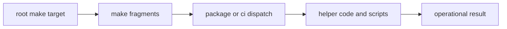

# makes

The `makes/` tree is the shared command interface for repository operations. It
turns recurring work into named, checked-in entrypoints instead of leaving
maintainers to reconstruct procedure from workflow YAML or shell history.

A good make surface is traceable. A maintainer should be able to start from a
root command, find the owning fragment quickly, and see whether the rule is
repository scope, package scope, CI scope, or release scope.

## Command Model

The `makes/` tree is useful only when a maintainer can follow a command from
the root entrypoint into the fragment that owns it and then into the helper or
package surface that actually does the work. This page should make that route
easy to picture before anyone starts chasing includes.

## Section Pages

- [Make System Overview](https://bijux.io/bijux-canon/07-bijux-canon-maintain/makes/make-system-overview/)
- [Root Entrypoints](https://bijux.io/bijux-canon/07-bijux-canon-maintain/makes/root-entrypoints/)
- [Environment Model](https://bijux.io/bijux-canon/07-bijux-canon-maintain/makes/environment-model/)
- [Repository Layout](https://bijux.io/bijux-canon/07-bijux-canon-maintain/makes/repository-layout/)
- [Package Dispatch](https://bijux.io/bijux-canon/07-bijux-canon-maintain/makes/package-dispatch/)
- [CI Targets](https://bijux.io/bijux-canon/07-bijux-canon-maintain/makes/ci-targets/)
- [Package Contracts](https://bijux.io/bijux-canon/07-bijux-canon-maintain/makes/package-contracts/)
- [Release Surfaces](https://bijux.io/bijux-canon/07-bijux-canon-maintain/makes/release-surfaces/)
- [Authoring Rules](https://bijux.io/bijux-canon/07-bijux-canon-maintain/makes/authoring-rules/)

## Start With

- Open [Make System Overview](https://bijux.io/bijux-canon/07-bijux-canon-maintain/makes/make-system-overview/) for the layered shape of the command tree.
- Open [Root Entrypoints](https://bijux.io/bijux-canon/07-bijux-canon-maintain/makes/root-entrypoints/) when the question begins at `Makefile`.
- Open [Package Dispatch](https://bijux.io/bijux-canon/07-bijux-canon-maintain/makes/package-dispatch/) when a shared target routes into one package or
  many.
- Open [CI Targets](https://bijux.io/bijux-canon/07-bijux-canon-maintain/makes/ci-targets/) or [Release Surfaces](https://bijux.io/bijux-canon/07-bijux-canon-maintain/makes/release-surfaces/) when the concern is automation-facing.

## Proof Path

- `Makefile` is the top-level entrypoint.
- `makes/root.mk`, `makes/env.mk`, and `makes/packages.mk` assemble the shared
  tree.
- `makes/bijux-py/` and `makes/packages/` show the reusable and package-bound
  parts of the command surface.

## Boundary

The make layer documents command routing and shared operational rules. It should
not become a second product handbook. If understanding a target requires a deep
product explanation, the product package docs still own that explanation.

## Design Pressure

If command ownership is hidden behind too many includes or naming shortcuts,
the shared interface stops being reviewable. This section has to keep entry
targets, fragments, and delegated work visibly aligned.
