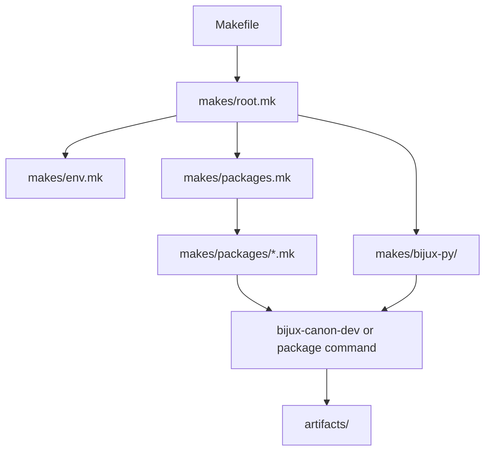
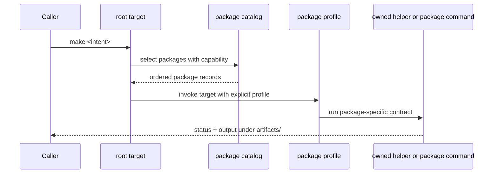

# Make System

The repository Make system is the supported command graph for local validation,
documentation, API governance, package dispatch, builds, SBOMs, and release
preparation. It exposes memorable root targets while keeping package-specific
arguments in explicit profiles.

Run `make help` for the live command catalog. The generated help text is derived
from target annotations, so it is more authoritative than a copied command
list.

## Include And Dispatch Graph

```mermaid
flowchart TD
    entry["Makefile"]
    root["makes/root.mk"]
    env["makes/env.mk"]
    catalog["makes/packages.mk"]
    shared["makes/bijux-py/"]
    profiles["makes/packages/*.mk"]
    helper["bijux-canon-dev or package command"]
    artifacts["artifacts/"]

    entry --> root
    root --> env
    root --> catalog
    root --> shared
    catalog --> profiles
    profiles --> helper
    shared --> helper
    helper --> artifacts
```

`makes/bijux-py/` contains reusable Python-repository machinery consumed by the
root. Repository-specific inventory and aliases remain in `makes/packages.mk`;
per-package differences remain in `makes/packages/<slug>.mk`; schema freeze,
documentation shell, standards, and publication composition have their own
named fragments.

## Root Command Families

| Intent | Target | Scope |
| --- | --- | --- |
| discover commands | `make help` | render annotated targets from included modules |
| verify lock consistency | `make lock-check` | compare `uv.lock` with workspace metadata |
| verify one documentation change | `make docs-check` | prepare generated references, run strict MkDocs build, enforce docs hygiene |
| verify API contracts | `make api` | dispatch API lint, drift, pin/hash, and live checks across primary package profiles |
| run ordinary package tests | `make test` | dispatch primary package test targets |
| run every test surface | `make test-all` | include slow, evaluation, and real-local selections |
| verify the repository | `make check` | lock plus lint, tests, quality, security, docs, API, builds, and SBOMs |
| build publication artifacts | `make build` | dispatch buildable primary package profiles |
| produce supply-chain artifacts | `make sbom` | dispatch SBOM-capable package profiles |

`make test-all` is intentionally broader and more expensive than ordinary
verification. Use it only when the changed contract reaches those test
surfaces; it is not the default evidence for a Markdown-only change.

## Read Dispatch As A Contract

Root targets select package records by capability and invoke each package
through its checked-in profile. The dispatch path is part of the result:

```mermaid
sequenceDiagram
    participant Caller
    participant Root as root target
    participant Catalog as package catalog
    participant Profile as package profile
    participant Helper as owned helper or package command

    Caller->>Root: make <intent>
    Root->>Catalog: select packages with capability
    Catalog-->>Root: ordered package records
    Root->>Profile: invoke target with explicit profile
    Profile->>Helper: run package-specific contract
    Helper-->>Caller: status + output under artifacts/
```

This explains three common surprises:

- package directories do not need standalone Makefiles; dispatch supplies the
  absolute profile with `make -f ... -C packages/<slug> <target>`;
- a package absent from a capability group is not silently skipped—it was not
  selected, so the catalog or profile is the first authority to inspect; and
- a root success means every selected package target succeeded, not that an
  unselected capability or a separate publication destination was evaluated.

Use `make list` to inspect the primary set, `make list-all` for every canonical
slug, and `make help` for the live root command surface before assuming a copied
command still reflects the repository graph.

## Package Inventory Is Data

`makes/packages.mk` declares primary and compatibility records with capability
labels such as `check`, `buildable`, `sbom`, `test`, and `api`. Root dispatch
selects packages from those labels. Compatibility aliases map preserved names
to canonical owners without pretending the aliases are primary product
packages.

This design makes exclusions reviewable. A package missing from an API or SBOM
dispatch set should be explained by its declared profile, not by an invisible
shell condition.

## Follow A Target

To explain a command, trace four layers:

1. find the target annotation with `make help`;
2. locate its definition or shared template in `makes/`;
3. resolve the selected package profile and helper invocation;
4. inspect the exit status and output under `artifacts/`.

For example, a package API target can resolve through a shared API template to
an `openapi_drift` module call declared in the package profile. The root command
establishes orchestration; the helper establishes the drift decision; the
owning package establishes HTTP behavior.

## Stable Operational Rules

- Root targets describe intent and delegate package behavior.
- Generated output belongs under `artifacts/` unless a target explicitly
  updates a governed source such as an API pin or documentation reference.
- Package-specific flags live in package profiles, not duplicated root recipes.
- CI invokes the same supported Make surfaces where practical.
- Destructive targets name their scope; repository cleanup must not rely on an
  unresolved broad path.
- A new target must appear in `make help` with a concrete description.

## Continue By Concern

| Concern | Page |
| --- | --- |
| root targets and their contract | [Root entrypoints](root-entrypoints.md) |
| environment and artifact locations | [Environment model](environment-model.md) |
| physical include structure | [Repository layout](repository-layout.md) |
| package selection and profiles | [Package dispatch](package-dispatch.md) |
| workflow-facing targets | [CI targets](ci-targets.md) |
| expectations for package profiles | [Package contracts](package-contracts.md) |
| build and publication composition | [Release surfaces](release-surfaces.md) |
| conventions for new targets | [Authoring rules](authoring-rules.md) |
