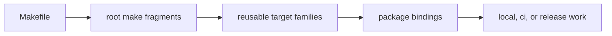

# Make System Overview

The repository make system is the shared command language for local work, CI,
package dispatch, and release preparation. It begins at `Makefile` and becomes
more specific as responsibility moves into root fragments, reusable contracts,
and package bindings.

## Layer Model

The overview should let a maintainer follow command ownership without reading
the whole tree first. If the reader cannot tell where repository policy ends
and package dispatch begins, the make surface has already become harder to
trust than the work it is supposed to simplify.

## Core Layers

- `Makefile` for the top-level entrypoint
- `makes/root.mk` for repository assembly
- `makes/env.mk` and `makes/packages.mk` for shared environment and package
  catalog setup
- `makes/bijux-py/` for reusable contracts and target families
- `makes/packages/` for canonical and compatibility package bindings

## Why Layering Matters

A layered make tree keeps command ownership visible. A reviewer can tell whether
a target is repository policy, reusable infrastructure, package dispatch, or a
package-local binding instead of treating `make` as a bag of aliases.

## First Proof Check

- `Makefile`
- `makes/root.mk`
- `makes/bijux-py/`
- `makes/packages/`

## Design Pressure

The make layer has to stay explicit enough that a reviewer can trace a target
from entrypoint to delegated implementation. Once that route becomes opaque,
command reuse turns into hidden policy.
