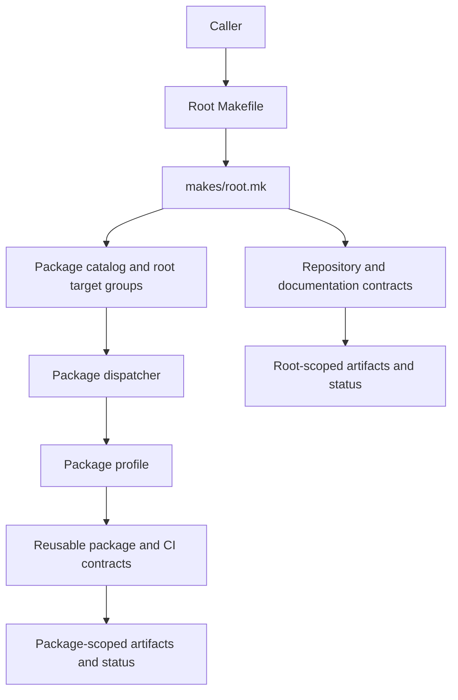

# Make System Overview

Make is the repository's executable control plane. The same target contracts
support local work and CI: the root exposes discoverable commands, the catalog
defines package membership, the dispatcher supplies package context, and a
package profile binds reusable target families to one project.

```mermaid
flowchart TD
    U[Caller] --> E[Root Makefile]
    E --> R[makes/root.mk]
    R --> C[Package catalog and root target groups]
    C --> D[Package dispatcher]
    D --> P[Package profile]
    P --> K[Reusable package and CI contracts]
    K --> A[Package-scoped artifacts and status]
    R --> Q[Repository and documentation contracts]
    Q --> B[Root-scoped artifacts and status]
```

## Assembly order

The root `Makefile` includes `makes/root.mk`. That file assembles the command
surface in an intentional order:

1. root and repository environment defaults;
2. the package catalog and aliases;
3. repository contract targets;
4. package dispatch;
5. documentation, shared-standards, configuration, and layout targets; and
6. generated help from all included modules.

GNU Make processes includes as one program. A variable assigned before a later
include can therefore configure that module, while a target declared after the
includes can group targets supplied by several modules. Include order is part
of the contract, not incidental formatting.

## Command classes

| Command class | Examples | Execution boundary |
| --- | --- | --- |
| repository lifecycle | `install`, `lock-check`, `check-config-layout`, `docs-check` | repository root |
| package dispatch | `test`, `lint`, `quality`, `security`, `api`, `build`, `sbom` | selected catalog packages |
| broad orchestration | `check`, `all`, `test-all` | several repository and package surfaces |
| direct profile | `make -f "$PWD/makes/packages/<slug>.mk" -C packages/<slug> help` | one package profile |

`PACKAGE=<slug>` narrows a dispatch command. Without it, the target uses the
package group recorded in `makes/packages.mk`. Aliases resolve before profile
selection, so an older public package name reaches its canonical package rather
than inventing a second automation path.

## Reusable contracts and profiles

`makes/bijux-py/package.mk` composes test, lint, quality, security, build, SBOM,
API, and publication modules. Package profiles under `makes/packages/` declare
identity and controlled differences such as import name, package kind, test
markers, API mode, or a security exclusion. A profile should remain a binding
layer; common shell or Python logic belongs in a reusable contract or a tested
`bijux-canon-dev` helper.

## Failure semantics

The root dispatcher executes every selected package, records each failed slug,
and exits with status `2` after the group completes. A missing profile is a
failure. Package output is preserved under its artifact root, while the
dispatcher invokes root-pollution cleanup on exit.

This behavior makes a group failure inspectable without hiding later package
results. It does not turn independent package checks into a transaction: any
generated evidence already written remains available for diagnosis.

## Trace a target

For `make api PACKAGE=bijux-canon-ingest`, inspect in this order:

1. `makes/packages.mk` for catalog membership and profile mapping;
2. `makes/bijux-py/root/package-dispatch.mk` for context and failure handling;
3. `makes/packages/bijux-canon-ingest.mk` for `API_MODE` and package overrides;
4. `makes/bijux-py/api.mk` and the selected API contract; and
5. `artifacts/bijux-canon-ingest/api/` for evidence.

That route identifies who selected the package, who owns the shared behavior,
which differences are intentional, and where the result is retained.
