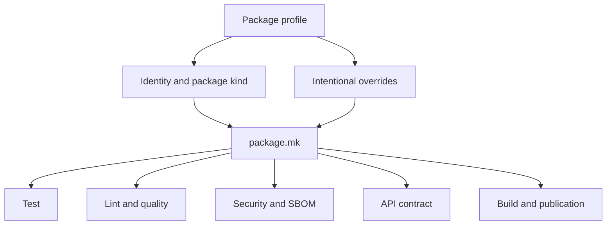

# Package Contracts

A package profile declares identity and bounded variation. Reusable contracts
own target behavior. This split gives every package a recognizable command
surface while preserving real differences in testing, API verification,
dependency topology, and publication.

## Package kinds

| Kind | Intended use | Important defaults |
| --- | --- | --- |
| `python` | a conventional Python package or the maintenance helper | editable development install and shared target families |
| `repository-python` | Python code representing a repository-scoped tool | repository config paths and repository-scoped build/SBOM outputs |
| `api-python` | independently packaged service or library with an API surface | API contract, stricter quality options, build verification, and API-aware cleanup |
| `workspace-python` | package integrated with sibling workspace dependencies | local dependency resolution, split test lanes, strict typing, and workspace API defaults |

An unsupported kind is a parse-time error. Package kinds set a baseline; a
profile may override a value only when the package owns a genuine exception.

## Standard target families

The shared contract composes these families:

- installation, bootstrap, soft cleanup, and full cleanup;
- unit, end-to-end, regression, evaluation, and real-local tests;
- formatting, lint, typing, dependency, documentation, and complexity checks;
- source scanning, dependency audit, and production dependency checks;
- OpenAPI lint, drift, live conformance, or freeze verification;
- wheel and source-distribution build checks;
- CycloneDX SBOM generation and validation; and
- release-dry and guarded publication preparation.

Not every package exposes every lane. Absence, skip, and success must remain
distinct. For example, an API profile with `API_SKIP_IF_NO_SCHEMAS` reports the
missing contract rather than pretending it validated one.

## API modes

`API_MODE` selects the contract included by `makes/bijux-py/api.mk`:

| Mode | Contract |
| --- | --- |
| `contract` | validate a checked-in schema and configured API behavior |
| `live-contract` | compare the running application with its schema and exercise requests |
| `freeze` | verify the checked-in API freeze and its generated representation |
| off or package exclusion | no API target in that package's root API group |

The package profile owns application imports, factories, base paths,
Schemathesis options, schema paths, and controlled exclusions. Shared modules
own the validation sequence and artifact locations.

## Override rules

A profile may declare:

- import and source paths;
- test selection and package-specific markers;
- known security exclusions with concrete ownership;
- build verification commands;
- API mode and application bindings;
- additional source or cleanup paths; and
- enablement of optional target families.

A profile should not copy a reusable recipe, redefine a common failure policy,
or encode repository package membership. Repeated behavior belongs in
`makes/bijux-py/`; structured comparison or parsing belongs in a tested
`bijux-canon-dev` module.

## Compatibility profiles

Compatibility distributions share `makes/packages/compat-package.mk`. The
profile resolves the corresponding canonical package, installs it as the
behavior owner, and then tests wrapper imports, metadata, commands, build, and
publication preparation. Compatibility automation must not create independent
product semantics.

## Review a profile change

1. Confirm the package kind still represents its dependency and release model.
2. Determine whether the proposed variable is an owned difference or repeated
   shared policy.
3. Inspect the expanded target with `make -n` or profile `help` when useful.
4. Run the narrow affected target through the root dispatcher.
5. Inspect the package artifact directory and failure output.

The profile is correct when its declarations explain why the package differs
and the reusable contract still explains how the target behaves.
