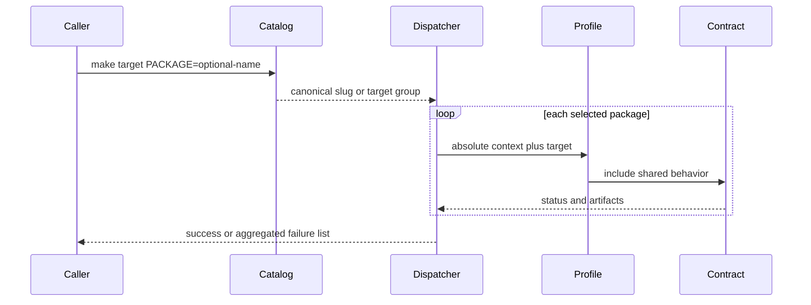

# Package Dispatch

Package dispatch converts one root command into explicit work over cataloged
packages. The catalog decides membership, aliases, and profile location; the
dispatcher supplies execution context and reports every failed package.



## Catalog records

Each record in `makes/packages.mk` contains a slug, comma-separated groups, and
a profile file. Groups derive the root target sets:

| Group | Used by |
| --- | --- |
| `test` | primary package test dispatch |
| `check` | lint and quality, plus fallback selection |
| `api` | API verification |
| `buildable` | distribution builds |
| `sbom` | software-bill-of-materials generation |
| `primary` and `compat` | public package listing and ownership classification |

Catalog parsing also refuses missing package directories, missing profile
files, and package directories that lack records. Package inventory therefore
fails while Make is loading, before a partial group can run.

## Selection and aliases

```bash
make test
make test PACKAGE=bijux-canon-index
make test PACKAGE=bijux-vex
```

With no `PACKAGE`, the target's derived group is selected. A canonical slug
selects one package. A known compatibility alias, such as `bijux-vex`, resolves
to the canonical `bijux-canon-index` profile. Any other value exits with status
`2` and prints valid package names and aliases.

An alias changes routing only. Compatibility distributions remain separate
catalog records because their wrapper imports, metadata, and build contracts
must be tested as artifacts in their own right.

## Execution context

For each selected package the dispatcher:

1. resolves the catalog profile, with a named-profile fallback;
2. changes the working directory to `packages/<slug>`;
3. passes absolute repository, configuration, project, API, and artifact paths;
4. optionally binds the shared root check environment for the target family;
5. invokes the requested profile target; and
6. records the slug if the target fails.

Test, lint, and quality use the shared check environment by default. API,
build, SBOM, clean, and repository-configured security dispatch use package
environments. This distinction is declared by target family rather than hidden
inside each profile.

## Failure and cleanup behavior

Dispatch continues after one package fails so the caller receives the complete
failed-slug list. It exits with status `2` if any profile is missing or any
package target fails. Output already produced by packages remains beneath their
artifact roots for diagnosis.

An exit trap invokes `clean-root-artifacts` to remove stray root caches. It
does not delete package evidence and does not turn a failed group into success.

## Review boundary

Change the dispatcher for selection, context propagation, group execution, or
failure aggregation. Change the catalog for membership, aliases, groups, or
profile mapping. Change a package profile only for an owned package difference.
Product behavior never belongs in any of these routing layers.
