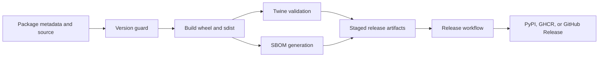

# Release Surfaces

The Make release surface prepares and validates reproducible package evidence.
GitHub workflows own protected credentials, artifact transfer, environment
approval, and publication. Keeping these responsibilities separate allows a
release candidate to be inspected locally without reproducing a privileged
deployment context.



## Make responsibilities

| Contract | Responsibility | Evidence |
| --- | --- | --- |
| `makes/bijux-py/ci/build.mk` | build wheel and source distribution, run `twine check`, execute configured pre/post checks | package build or release directory and `twine-check.log` |
| `makes/bijux-py/ci/sbom.mk` | resolve version, produce production and development CycloneDX documents, summarize, and optionally validate | package SBOM directory |
| `makes/bijux-py/repository/publish.mk` | verify version and distribution set, stage TestPyPI or PyPI upload, optionally verify an installed TestPyPI package | validated distributions and command result |
| `makes/publish.mk` | bind repository version resolver and publication guard, with release policy defaults | guarded package version |

`make build PACKAGE=<slug>` and `make sbom PACKAGE=<slug>` use the root package
catalog. Publication targets are profile-level because upload policy and
installation verification belong to a specific distribution.

## Version and distribution guard

The version resolver reads package metadata. The publication guard rejects an
unresolved `0.0.0`, disallowed prerelease or local versions, package/version
mismatches, and inconsistent distribution filenames. A guarded publication
requires both a wheel and source distribution before upload.

`release-dry` runs a package-defined post-build check when configured. A
message that no dry-run command exists is an explicit absence of that extra
claim, not a repository-wide release certification.

## SBOM evidence boundary

The `sbom` generator captures production and development dependency views and
writes a summary. Its `pip-audit` generation commands are tolerant so partial
diagnostic output can be retained. Therefore `make sbom` alone is not a strict
CycloneDX acceptance claim.

Use the profile validator when certification is required:

```bash
make sbom PACKAGE=bijux-canon-runtime
make -f "$PWD/makes/packages/bijux-canon-runtime.mk" \
  -C packages/bijux-canon-runtime sbom-validate
```

The validator refuses a missing CycloneDX CLI, an empty SBOM directory, or an
invalid document.

## Publication controls

Upload is disabled by default in the reusable contract. When enabled, the
target requires a token, uses non-interactive Twine, and may skip an already
published file only when `SKIP_EXISTING=1`. TestPyPI installation verification
creates an isolated environment and runs the profile's configured smoke
command.

Credentials never belong in package profiles or generated artifacts. Workflow
permissions and protected environments determine which publication jobs may
receive them.

## Workflow handoff

A publication workflow consumes previously built, identified artifacts. It
must not rebuild a different candidate after approval. Review the artifact
name, producer run, digest or checksums, target environment, permissions, and
downstream receipt before treating publication as complete.

| State | Valid claim |
| --- | --- |
| build target passed | distributions were built and locally validated |
| strict SBOM validation passed | generated CycloneDX documents are structurally valid |
| release artifact uploaded to Actions | candidate is retained for downstream jobs |
| package registry accepted upload | named distribution is published |
| post-publication install passed | published distribution can be resolved and executes its smoke contract |

Release confidence comes from preserving this custody chain, not from treating
one green job as proof of every stage.
