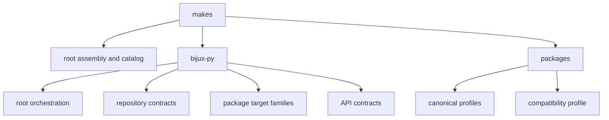

# Repository Layout

The `makes/` tree encodes ownership. Repository assembly, reusable package
behavior, repository contracts, and package declarations live in separate
areas so a change can be reviewed at the boundary it affects.



## Directory map

| Path | Responsibility |
| --- | --- |
| `makes/root.mk` | assemble the public root command surface |
| `makes/env.mk` | repository overlay and helper bindings |
| `makes/packages.mk` | package records, aliases, groups, and profile mapping |
| `makes/bijux-py/root/` | root environment, lifecycle, docs, and package dispatch |
| `makes/bijux-py/repository/` | repository layout, artifact alias, publish, and configuration contracts |
| `makes/bijux-py/ci/` | reusable lint, test, quality, security, build, SBOM, docs, and help families |
| `makes/bijux-py/api*.mk` | API-mode selection and contract implementations |
| `makes/bijux-py/package.mk` | package-kind defaults and target composition |
| `makes/packages/` | canonical package profiles and the shared compatibility profile |

## Route changes by ownership

| Needed change | Correct area |
| --- | --- |
| add a package or alias | `makes/packages.mk` and catalog-backed contracts |
| add a root orchestration group | `makes/bijux-py/root/` or `makes/root.mk` |
| change a rule shared by packages | relevant `makes/bijux-py/ci/` or API module |
| change repository tree validation | `makes/bijux-py/repository/` and its helper/tests |
| bind one package to existing behavior | `makes/packages/<slug>.mk` |
| parse or compare structured repository data | `bijux-canon-dev`, called from Make |
| change workflow trigger or permissions | owning workflow source, while retaining the Make target |

Adding a peer file is not automatically the right extension. Prefer an existing
owned module when the behavior belongs to that contract, and introduce a new
module only for a durable responsibility with a clear caller.

## Catalog as the package authority

`makes/packages.mk` records canonical and compatibility packages with tags such
as `primary`, `check`, `buildable`, `sbom`, `test`, and `api`. The catalog
derives target groups and profile mappings from these records. Root groups must
consume those derived lists rather than repeat package slugs in several files.

Aliases map former public names to canonical packages before dispatch. They are
compatibility routes, not additional catalog identities.

## Layout invariants

The repository layout check protects required entrypoints, allowed placement,
and the relationship between profiles and catalog records. Generated shared
Make content under `.bijux/shared/` is consumed as managed input; repository
overlays may configure it but must not silently fork it.

Useful inspection commands are:

```bash
make check-make-layout
make list
make list-all
make help
```

`check-make-layout` proves structural policy. A focused package target is still
required when behavior inside a profile or reusable contract changes.

## Avoid ownership erosion

The layout is weakening when package profiles accumulate copied recipes, root
fragments acquire product semantics, workflows reimplement local checks, or a
generic helper directory becomes the only place a rule can be understood.
Repair the ownership boundary instead of documenting the duplication as a new
convention.
