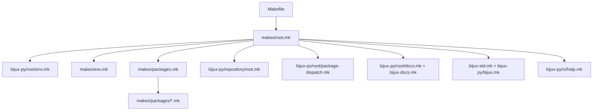

# Root Entrypoints

The root Make surface converts repository intent into package-specific work.
`Makefile` is deliberately small: it includes `makes/root.mk`, which assembles
the environment, package catalog, reusable target families, repository checks,
documentation commands, standards checks, and generated help.

## Include Graph



The include order matters because repository variables and package records are
available before dispatch templates expand. The live expansion can be inspected
with `make -prRn`; maintainers normally begin with `make help`.

## Public Root Targets

| Target | Contract |
| --- | --- |
| `help` | render annotated repository commands from the assembled graph |
| `list` | list primary package slugs |
| `list-all` | list every primary and compatibility package record |
| `install` | synchronize the shared root uv environment from locked metadata |
| `lock-check` | refuse drift between `pyproject.toml` and `uv.lock` |
| `test`, `lint`, `quality`, `security`, `api`, `build`, `sbom` | dispatch one command family across eligible package profiles |
| `docs`, `docs-check`, `docs-serve`, `docs-deploy` | build, validate, serve, or publish the handbook through isolated docs paths |
| `check` | require lock consistency, then run the full ordinary repository verification graph |
| `test-all` | invoke every configured test surface, including slow, evaluation, and real-local selections |
| `candidate-frozen` | launch the deduplicated tests, product acceptance, quality/typing, security, docs/API, build/real-wheel, and SBOM graph against one immutable commit |
| `frozen-status` | emit compact JSON lifecycle state for one commit and gate without reading its log |
| `frozen-summary` | emit the same state plus a bounded failure tail; exit `0` passed, `1` failed, `3` running, `4` not started, or `5` stale |
| `all-frozen` | compatibility alias that launches the one candidate graph once |
| `setup`, `clean`, `clean-root-artifacts` | materialize aliases or remove explicitly scoped generated state |

Use the target that names the contract being reviewed. `test-all` is not a
substitute for selecting the affected surface, and `check` is not required to
establish that a Markdown link renders.

Frozen launches are keyed by the resolved commit and gate. A second launch for
the same identity is refused whether the first is active or complete. Inspect a
record directly instead:

```bash
make frozen-status FROZEN_REF="$H" GATE=candidate
make frozen-summary FROZEN_REF="$H" GATE=candidate
```

`frozen-status` exits successfully whenever the record can be inspected and
reports its lifecycle in JSON. `frozen-summary` has stable lifecycle exit codes
for automation and includes at most the bounded tail when a gate failed or
became stale.

## Package Dispatch

`makes/packages.mk` supplies three pieces of data:

- primary package records and their capabilities;
- compatibility package records; and
- aliases from preserved names to canonical owners.

Shared templates use those records to decide which profiles receive a target.
The profile under `makes/packages/<slug>.mk` supplies package-specific paths,
extras, API commands, and additional checks. Compatibility packages share a
dedicated profile because they prove delegation rather than product behavior.

## Resolve An Unexpected Command

```bash
make help
make -prRn | rg '^docs-check:'
rg -n 'docs-check' Makefile makes
```

Replace `docs-check` with the target under review. Then inspect the selected
profile and the invoked Python module or package command. Generated output and
logs should resolve under `artifacts/`; a new root-level cache is evidence of a
path ownership defect.

## Extension Rule

A new root entrypoint must have one durable intent, an annotated help
description, explicit package-selection rules, predictable artifact paths, and
a focused contract test when it changes repository structure. Product semantics
stay behind package targets rather than moving into a root shell recipe.

Continue with [package dispatch](package-dispatch.md) for record expansion and
[environment model](environment-model.md) for root and package environments.
