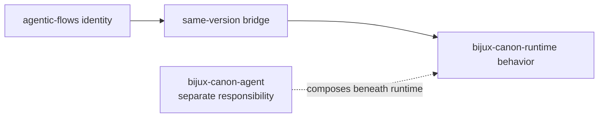
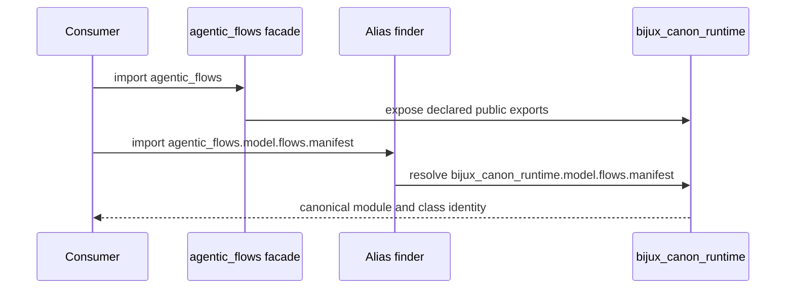

# agentic-flows

`agentic-flows` is a compatibility distribution for
`bijux-canon-runtime`. It preserves the former runtime distribution, import,
and executable identities after implementation ownership moved into the Bijux
Canon repository.

The name can suggest agent-only orchestration, but its canonical target is
runtime, not `bijux-canon-agent`. Runtime owns whole-flow admission,
persistence, resume, and replay; agent owns bounded role orchestration.

## Choose The Right Owner

| Need | Install | Reason |
| --- | --- | --- |
| keep a deployed `agentic-flows` dependency or command working | `agentic-flows` | preserves former runtime identities during migration |
| build a new executable flow | `bijux-canon-runtime` | runtime owns flow admission, execution, and replay |
| orchestrate bounded agent roles | `bijux-canon-agent` | agent owns role policy and coordination, not whole-run persistence |
| use only ingest, index, or reason capabilities | the corresponding canonical package | the bridge is not a family-wide dependency |

## Identity Contract

| Surface | Preserved identity | Canonical identity |
| --- | --- | --- |
| distribution | `agentic-flows` | `bijux-canon-runtime` |
| Python root | `agentic_flows` | `bijux_canon_runtime` |
| console command | `agentic-flows` | `bijux-canon-runtime` |
| nested CLI module | `agentic_flows.interfaces.cli.entrypoint` | `bijux_canon_runtime.interfaces.cli.entrypoint` |
| representative nested type | `agentic_flows.model.flows.manifest.FlowManifest` | `bijux_canon_runtime.model.flows.manifest.FlowManifest` |



The built bridge pins `bijux-canon-runtime` to the bridge's exact version.
Its root import forwards runtime's public exports, nested aliases resolve to
canonical module objects, and both console and module execution call the
runtime CLI.

## How The Bridge Resolves Code

The `agentic_flows` package owns only its facade, module entrypoint, typing
marker, and alias resolver. Importing its root reads the canonical runtime's
declared export list without eagerly importing execution or persistence.
Importing a nested compatibility path resolves the same suffix beneath
`bijux_canon_runtime` and returns that canonical module object.



Preserving identity avoids duplicated types in `isinstance` checks,
registries, exception handling, and serialized object graphs. It does not make
undocumented private modules permanent API.

## Use An Existing Integration

```bash
python -m pip install agentic-flows
agentic-flows --help
python -m agentic_flows --help
```

```python
from agentic_flows import FlowManifest
```

The bridge supports continuity while a dependent application moves. Runtime
behavior, configuration, artifacts, and current API guidance are documented in
the [runtime handbook](../../06-bijux-canon-runtime/index.md).

The `agentic-flows` command and `python -m agentic_flows` delegate directly to
the canonical CLI. No compatibility-specific argument rewriting or output
normalization occurs. A consumer should therefore interpret exit codes,
structured output, persisted run directories, resume, and replay according to
the runtime contract.

## Migrate To Runtime Ownership

```bash
python -m pip install bijux-canon-runtime
bijux-canon-runtime --help
```

```python
from bijux_canon_runtime import FlowManifest
```

Update distribution metadata, root and nested imports, executable calls,
container entrypoints, and serialized dotted paths. The former standalone
repository URL is historical context; current source, issues, releases, and
documentation belong to `bijux/bijux-canon`.

## Accept A Migration

Record evidence at every boundary used by the consumer:

- manifests and lock files resolve `bijux-canon-runtime` at the intended
  release;
- source, plugins, configuration, and serialized metadata contain no required
  `agentic_flows.*` paths;
- scripts, images, schedulers, and runbooks invoke `bijux-canon-runtime`;
- representative executions preserve exit status, structured output, artifact
  layout, resume behavior, and replay results;
- deployed environments no longer independently request the `agentic-flows`
  distribution.

Both names may coexist during migration because they converge on one runtime.
Their coexistence is not an architectural boundary and should not be modeled
as two execution engines.

## Evidence And Limits

Repository contracts verify the exact dependency pin, representative exports
and nested type identity, lazy root loading, the CLI module identity, and the
canonical console target. These checks do not promise that every private path
from the former repository remains importable or that an old deployment's
external providers and stored artifacts need no migration. Those require
consumer-owned execution and replay evidence.

Use [import surfaces](import-surfaces.md) for alias mechanics and
[migration guidance](../migration/migration-guidance.md) for a complete
consumer migration.
