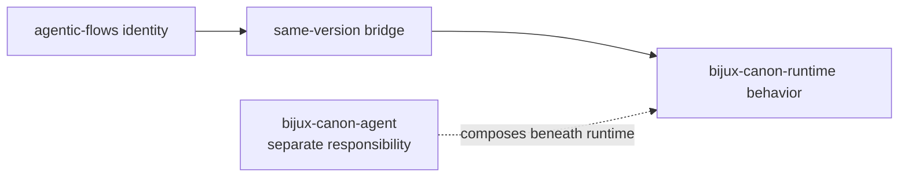

# agentic-flows

`agentic-flows` is a compatibility distribution for
`bijux-canon-runtime`. It preserves the former runtime distribution, import,
and executable identities after implementation ownership moved into the Bijux
Canon repository.

The name can suggest agent-only orchestration, but its canonical target is
runtime, not `bijux-canon-agent`. Runtime owns whole-flow admission,
persistence, resume, and replay; agent owns bounded role orchestration.

## Identity Contract

| Surface | Preserved identity | Canonical identity |
| --- | --- | --- |
| distribution | `agentic-flows` | `bijux-canon-runtime` |
| Python root | `agentic_flows` | `bijux_canon_runtime` |
| console command | `agentic-flows` | `bijux-canon-runtime` |
| nested CLI module | `agentic_flows.interfaces.cli.entrypoint` | `bijux_canon_runtime.interfaces.cli.entrypoint` |
| representative nested type | `agentic_flows.model.flows.manifest.FlowManifest` | `bijux_canon_runtime.model.flows.manifest.FlowManifest` |



The built bridge pins `bijux-canon-runtime` to the bridge's exact version.
Its root import forwards runtime's public exports, nested aliases resolve to
canonical module objects, and both console and module execution call the
runtime CLI.

## Use An Existing Integration

```bash
python -m pip install agentic-flows
agentic-flows --help
python -m agentic_flows --help
```

```python
from agentic_flows import FlowManifest
```

The bridge supports continuity while a dependent application moves. Runtime
behavior, configuration, artifacts, and current API guidance are documented in
the [runtime handbook](../../06-bijux-canon-runtime/index.md).

## Migrate To Runtime Ownership

```bash
python -m pip install bijux-canon-runtime
bijux-canon-runtime --help
```

```python
from bijux_canon_runtime import FlowManifest
```

Update distribution metadata, root and nested imports, executable calls,
container entrypoints, and serialized dotted paths. The former standalone
repository URL is historical context; current source, issues, releases, and
documentation belong to `bijux/bijux-canon`.

## Evidence And Limits

Repository contracts verify the exact dependency pin, representative exports
and nested type identity, the CLI module identity, and the canonical console
target. These checks do not promise that every private path from the former
repository remains importable or that an old deployment's external providers
and stored artifacts need no migration.

Use [import surfaces](import-surfaces.md) for alias mechanics and
[migration guidance](../migration/migration-guidance.md) for a complete
consumer migration.
