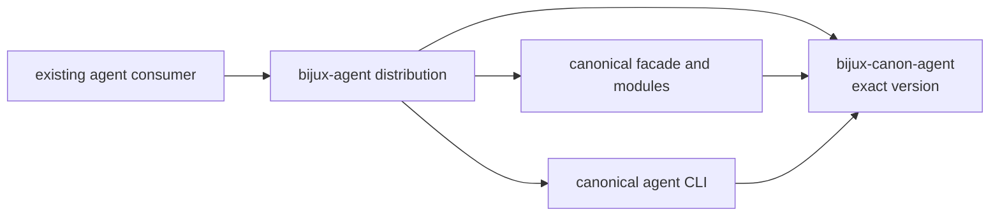
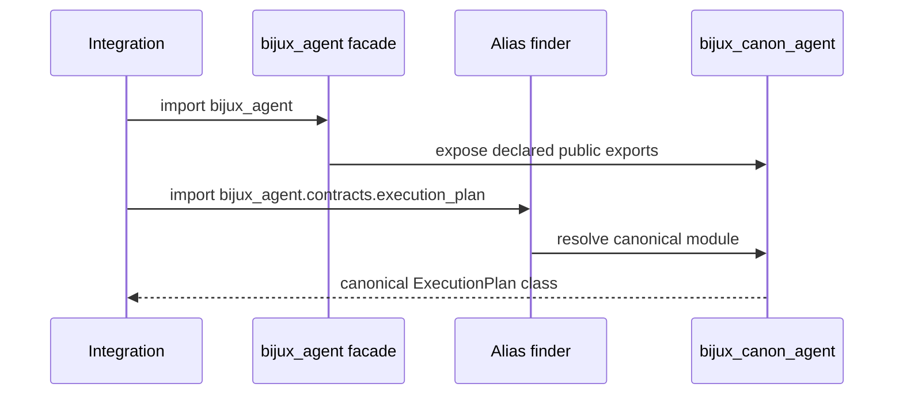

# bijux-agent

`bijux-agent` preserves the earlier distribution, import, and command names
for the canonical `bijux-canon-agent` package. Calls still execute the
canonical agent implementation: bounded role orchestration, ordered tool and
model interactions, convergence decisions, lifecycle events, and run traces.

The bridge adds no alternate scheduler, provider adapter, execution policy, or
trace format.

## When The Bridge Is Appropriate

| Situation | Choice | Evidence to retain |
| --- | --- | --- |
| a deployed application requires `bijux-agent` | keep the bridge during migration | resolved distribution and release |
| plugins or manifests contain `bijux_agent.*` paths | keep the bridge until stored references move | inventory of dynamic and serialized paths |
| a new integration needs agent orchestration | use `bijux-canon-agent` | canonical dependency and API usage |
| a workflow needs whole-run persistence or replay | use `bijux-canon-runtime` | runtime execution and replay evidence |

## Identity Contract

| Surface | Preserved identity | Canonical identity |
| --- | --- | --- |
| distribution | `bijux-agent` | `bijux-canon-agent` |
| Python root | `bijux_agent` | `bijux_canon_agent` |
| console command | `bijux-agent` | `bijux-canon-agent` |
| nested CLI module | `bijux_agent.interfaces.cli.entrypoint` | `bijux_canon_agent.interfaces.cli.entrypoint` |
| representative nested type | `bijux_agent.contracts.execution_plan.ExecutionPlan` | `bijux_canon_agent.contracts.execution_plan.ExecutionPlan` |



The facade and canonical package are not wrapper and wrapped agent engines.
The facade exposes the canonical root exports; its alias finder maps non-local
`bijux_agent.*` paths to the corresponding `bijux_canon_agent.*` modules.



The same class identity protects type comparison, dependency injection,
registries, and serialization while old and new imports coexist.

## Existing And Canonical Usage

An existing environment can retain its names while migration is scheduled:

```bash
python -m pip install bijux-agent
bijux-agent --help
python -m bijux_agent --help
```

```python
from bijux_agent import API_VERSION
from bijux_agent.contracts.execution_plan import ExecutionPlan
```

New code uses the canonical identities:

```bash
python -m pip install bijux-canon-agent
bijux-canon-agent --help
```

```python
from bijux_canon_agent import API_VERSION
from bijux_canon_agent.contracts.execution_plan import ExecutionPlan
```

The nested `ExecutionPlan` imports resolve to the same class object. This
matters when old and new imports coexist during a rollout: type comparisons
and registries do not see bridge-created wrapper classes.

Both `bijux-agent` and `python -m bijux_agent` invoke the canonical agent CLI.
No compatibility-specific layer changes role ordering, tool permissions,
provider calls, convergence decisions, lifecycle events, trace output, or exit
status.

## Accept A Migration

Migration evidence should demonstrate more than command discovery:

- package manifests and lock files resolve `bijux-canon-agent`;
- source, dynamic imports, manifests, plugin registries, fixtures, dependency
  injection, and serialized paths use `bijux_canon_agent`;
- scripts, images, schedulers, and runbooks invoke `bijux-canon-agent`;
- representative accepted and refused runs preserve result structure,
  interaction order, lifecycle events, and trace artifacts;
- deployed environments no longer independently request `bijux-agent`.

The bridge may remain installed during a rolling migration because both names
resolve one implementation. It is safe to remove only after every used
identity has moved.

## Migration Risks

Search beyond ordinary imports. Agent integrations often place module paths in
pipeline manifests, plugin registries, provider configuration, dependency
injection wiring, test fixtures, and serialized execution plans. Change those
surfaces deliberately and verify the consumer's real orchestration path.

The [agent handbook](../../05-bijux-canon-agent/index.md) defines current
behavior. Compatibility verifies alias identity and delegation; it does not
guarantee that every private module from an earlier standalone repository is a
supported canonical API or that historical provider behavior remains fixed.
Provider configuration, tool effects, and policy acceptance require evidence
from the consuming integration.

## Repository Ownership

Current source, issues, release metadata, and documentation are owned by
`bijux/bijux-canon`. The former `bijux/bijux-agent` repository URL is useful
for historical context, not as a second source of current implementation
authority.

Continue with [import surfaces](import-surfaces.md) for nested alias behavior
and [migration guidance](../migration/migration-guidance.md) for a complete
consumer inventory.
