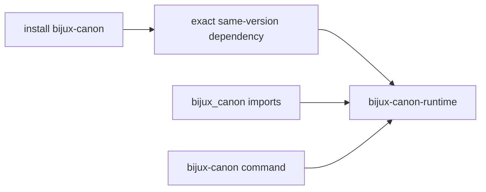

# bijux-canon

`bijux-canon` is the short-name compatibility distribution for
`bijux-canon-runtime`. It preserves an established family-root install, Python
import, and command while runtime remains the sole owner of execution,
admission, persistence, resume, and replay behavior.

This bridge does not represent the entire package family. Installing it gives
you runtime compatibility, not an umbrella dependency on ingest, index,
reason, and agent.

## Identity Contract

| Surface | Preserved identity | Canonical identity |
| --- | --- | --- |
| distribution | `bijux-canon` | `bijux-canon-runtime` |
| Python root | `bijux_canon` | `bijux_canon_runtime` |
| console command | `bijux-canon` | `bijux-canon-runtime` |
| nested CLI module | `bijux_canon.interfaces.cli.entrypoint` | `bijux_canon_runtime.interfaces.cli.entrypoint` |
| representative nested type | `bijux_canon.model.flows.manifest.FlowManifest` | `bijux_canon_runtime.model.flows.manifest.FlowManifest` |



The built compatibility wheel depends on
`bijux-canon-runtime==<bridge-version>`. Import forwarding and command
delegation therefore operate against the matching runtime release rather than
a floating compatible range.

## Use An Existing Integration

```bash
python -m pip install bijux-canon
bijux-canon --help
python -m bijux_canon --help
```

At the Python facade, established imports continue to resolve:

```python
from bijux_canon import FlowManifest
```

The compatibility root follows runtime's `__all__`, and representative nested
imports are tested for canonical object identity. Product semantics and their
documentation remain in the [runtime handbook](../../06-bijux-canon-runtime/index.md).

## Choose The Canonical Package For New Work

```bash
python -m pip install bijux-canon-runtime
bijux-canon-runtime --help
```

```python
from bijux_canon_runtime import FlowManifest
```

Use the canonical identity in new dependencies, source code, services, and
runbooks. Existing consumers can migrate dependency, import, and executable
surfaces independently as long as both distributions are not mistaken for
separate implementations.

## Evidence And Limits

Repository checks verify same-version dependency generation, root export
forwarding, representative nested module identity, and direct CLI delegation.
They do not turn private runtime modules into a permanent API, prove every
historical artifact readable, or guarantee a consumer's provider and storage
configuration.

Follow [migration guidance](../migration/migration-guidance.md) to inventory a
consumer and [retirement conditions](../migration/retirement-conditions.md)
before removing the short-name dependency.
