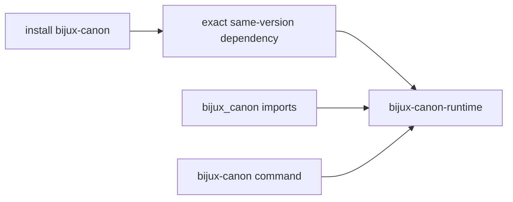
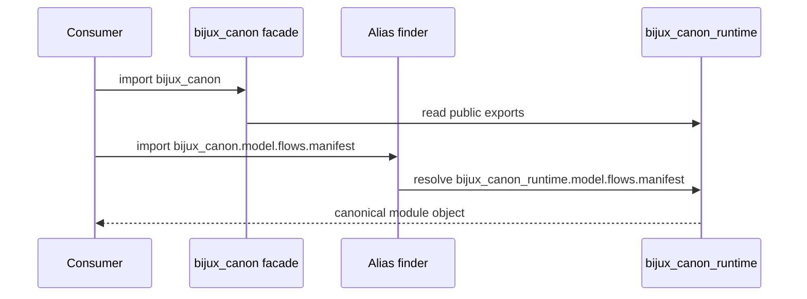

# bijux-canon

`bijux-canon` is the short-name compatibility distribution for
`bijux-canon-runtime`. It preserves an established family-root install, Python
import, and command while runtime remains the sole owner of execution,
admission, persistence, resume, and replay behavior.

This bridge does not represent the entire package family. Installing it gives
you runtime compatibility, not an umbrella dependency on ingest, index,
reason, and agent.

## When To Use This Distribution

| Situation | Choice | Why |
| --- | --- | --- |
| an existing lock file or deployment requires `bijux-canon` | keep the bridge while migrating | preserves the established distribution identity |
| source imports `bijux_canon` or invokes `bijux-canon` | keep the bridge until those call sites move | preserves import and executable resolution |
| a new application needs runtime execution | install `bijux-canon-runtime` | uses the package that owns the behavior directly |
| an application needs ingest, index, reason, or agent only | install that canonical package | the short-name bridge does not install the full family |

## Identity Contract

| Surface | Preserved identity | Canonical identity |
| --- | --- | --- |
| distribution | `bijux-canon` | `bijux-canon-runtime` |
| Python root | `bijux_canon` | `bijux_canon_runtime` |
| console command | `bijux-canon` | `bijux-canon-runtime` |
| nested CLI module | `bijux_canon.interfaces.cli.entrypoint` | `bijux_canon_runtime.interfaces.cli.entrypoint` |
| representative nested type | `bijux_canon.model.flows.manifest.FlowManifest` | `bijux_canon_runtime.model.flows.manifest.FlowManifest` |



The built compatibility wheel depends on
`bijux-canon-runtime==<bridge-version>`. Import forwarding and command
delegation therefore operate against the matching runtime release rather than
a floating compatible range.

## How Import Forwarding Behaves

Importing `bijux_canon` loads a small facade, copies the canonical runtime's
declared public export list, and forwards attribute lookup. It does not eagerly
load execution or persistence modules. When Python resolves a non-local nested
path below `bijux_canon`, the bridge looks up the same suffix below
`bijux_canon_runtime` and registers that canonical module under the
compatibility name.



This object identity matters for type checks, plugin registries, exception
handling, and serializers. The bridge is not a copied implementation and does
not manufacture parallel runtime classes.

## Use An Existing Integration

```bash
python -m pip install bijux-canon
bijux-canon --help
python -m bijux_canon --help
```

At the Python facade, established imports continue to resolve:

```python
from bijux_canon import FlowManifest
```

The compatibility root follows runtime's `__all__`, and representative nested
imports are tested for canonical object identity. Product semantics and their
documentation remain in the [runtime handbook](../../06-bijux-canon-runtime/index.md).

The command boundary follows the same rule. Both `bijux-canon` and
`python -m bijux_canon` call the runtime CLI entrypoint. The bridge does not
rewrite arguments or normalize results, so configuration discovery, exit
status, structured output, run directories, and replay semantics belong to the
runtime contract.

## Choose The Canonical Package For New Work

```bash
python -m pip install bijux-canon-runtime
bijux-canon-runtime --help
```

```python
from bijux_canon_runtime import FlowManifest
```

Use the canonical identity in new dependencies, source code, services, and
runbooks. Existing consumers can migrate dependency, import, and executable
surfaces independently as long as both distributions are not mistaken for
separate implementations.

## Accept A Migration

A migration is complete only when the consumer no longer relies on the
compatibility identity. Verify all of these boundaries:

- package manifests and resolved lock files name `bijux-canon-runtime`;
- Python source, dynamic imports, plugin declarations, and serialized dotted
  paths use `bijux_canon_runtime`;
- shell scripts, containers, schedulers, and runbooks invoke
  `bijux-canon-runtime`;
- representative runs preserve exit status, structured output, artifact
  layout, and replay results;
- deployed environments no longer contain an independently requested
  `bijux-canon` distribution.

Keeping both distributions installed during migration is supported because
they converge on one runtime. It should not be interpreted as evidence that
two runtime implementations exist.

## Evidence And Limits

Repository checks verify same-version dependency generation, lazy root export
forwarding, representative nested module identity, and direct CLI delegation.
They do not turn private runtime modules into a permanent API, prove every
historical artifact readable, or guarantee a consumer's provider and storage
configuration. Those claims require consumer-specific workflow and replay
evidence.

Follow [migration guidance](../migration/migration-guidance.md) to inventory a
consumer and [retirement conditions](../migration/retirement-conditions.md)
before removing the short-name dependency.
