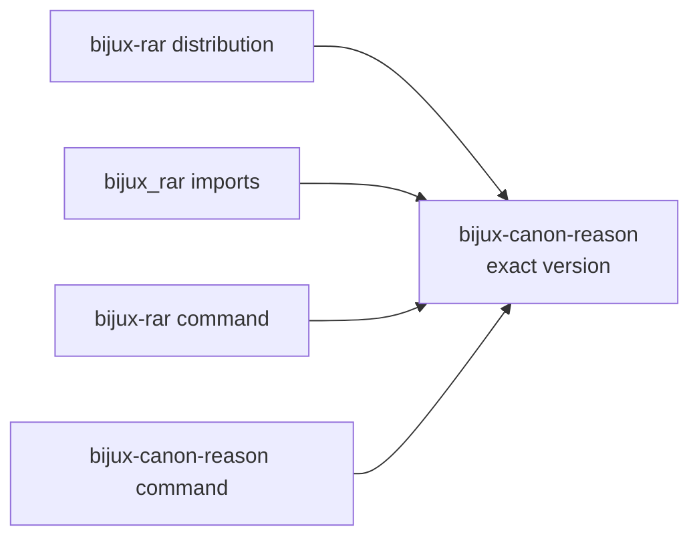

# bijux-rar

`bijux-rar` preserves the earlier reasoning distribution and Python import for
`bijux-canon-reason`. The canonical package owns problem plans, structured
claims, evidence references, reasoning traces, verification, and provenance.
The bridge contains no independent inference or verification implementation.

## Identity Contract

| Surface | Preserved identity | Canonical identity |
| --- | --- | --- |
| distribution | `bijux-rar` | `bijux-canon-reason` |
| Python root | `bijux_rar` | `bijux_canon_reason` |
| preferred command | `bijux-rar` | `bijux-canon-reason` |
| nested CLI module | `bijux_rar.interfaces.cli` | `bijux_canon_reason.interfaces.cli` |
| representative nested type | `bijux_rar.core.Claim` | `bijux_canon_reason.core.Claim` |



The canonical reason distribution currently registers both
`bijux-canon-reason` and `bijux-rar` to the same application. The compatibility
distribution also registers `bijux-rar` to that canonical application so the
command remains available to consumers that still install the old
distribution. This command continuity does not make the old Python root
canonical.

## Existing And Canonical Usage

```bash
python -m pip install bijux-rar
bijux-rar --help
python -m bijux_rar --help
```

```python
from bijux_rar import Claim, validate_plan
```

New dependencies and source imports use:

```bash
python -m pip install bijux-canon-reason
bijux-canon-reason --help
```

```python
from bijux_canon_reason import Claim, validate_plan
```

The root exports are forwarded, the tested nested `Claim` import retains
canonical identity, and the compatibility CLI module resolves to the canonical
module object.

## Migrate Evidence-Bearing Consumers

Reason integrations frequently retain plans, claims, traces, and provenance.
Inventory dependency and import names alongside serialized dotted paths,
artifact readers, schema assumptions, command invocations, and any code that
compares concrete types. Validate representative accepted and refused cases;
command discovery alone does not prove evidence semantics.

The [reason handbook](../../04-bijux-canon-reason/index.md) is authoritative
for current behavior. Compatibility checks establish delegation and selected
identity invariants, not permanent support for private modules or every
historical artifact representation.

## Repository Ownership

Current source, issues, release metadata, and documentation are owned by
`bijux/bijux-canon`. The former `bijux/bijux-rar` repository is historical
context rather than a second implementation source.

Continue with [dependency continuity](../migration/dependency-continuity.md)
for the release pin and [migration guidance](../migration/migration-guidance.md)
for the complete consumer surface.
