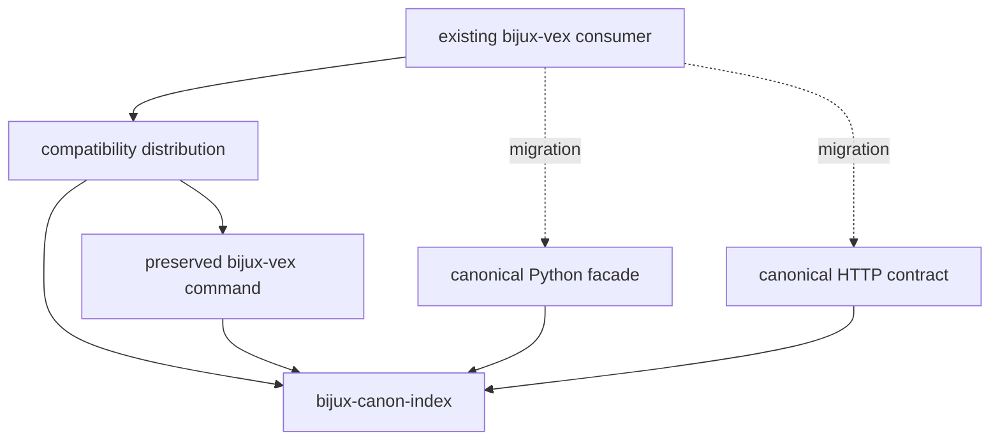
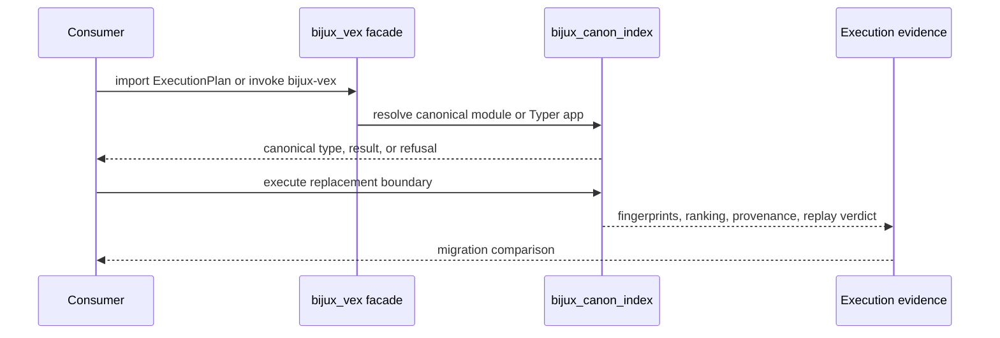

# bijux-vex

`bijux-vex` preserves the earlier index distribution, Python import, and
console command for `bijux-canon-index`. The canonical package owns vector
execution planning, capability resolution, state backends, ranked results,
replay comparison, and provenance.

The canonical wheel publishes `bijux-canon-index`. Both executable names invoke
the same application; the bridge adds no parser or index behavior.

## Choose A Replacement Boundary

| Consumer need | Supported boundary | Migration implication |
| --- | --- | --- |
| replace deployed command automation | `bijux-canon-index` | compare help, version, JSON output, and exit status before removing the bridge |
| embed index behavior in Python | documented `bijux_canon_index` facade | replace imports and validate returned contracts |
| retain a module command boundary | `python -m bijux_canon_index.interfaces.cli.app` | replace invocation and compare structured results |
| integrate across a service boundary | versioned HTTP API | map requests and responses to published schemas |

Use the canonical command for direct command migration.

## Identity Contract

| Surface | Preserved identity | Canonical identity |
| --- | --- | --- |
| distribution | `bijux-vex` | `bijux-canon-index` |
| Python root | `bijux_vex` | `bijux_canon_index` |
| console command | `bijux-vex` | `bijux-canon-index` |
| nested CLI module | `bijux_vex.interfaces.cli.app` | `bijux_canon_index.interfaces.cli.app` |
| representative nested type | `bijux_vex.core.runtime.execution_plan.ExecutionPlan` | `bijux_canon_index.core.runtime.execution_plan.ExecutionPlan` |



The bridge command delegates to the canonical index Typer application, but its
continued presence is a compatibility property. It must not be interpreted as
a canonical command contract for new systems.

## How Alias Identity Is Preserved

The `bijux_vex` root forwards the canonical package's declared exports. For a
non-local nested path, the bridge resolves the same suffix under
`bijux_canon_index` and registers that canonical module under the preserved
name.



This prevents duplicate plan types in validators, registries, and serializers.
It does not prove that command automation has selected the correct canonical
replacement boundary.

## Existing Import Continuity

```bash
python -m pip install bijux-vex
bijux-vex --help
python -m bijux_vex --help
```

```python
from bijux_vex.core.runtime.execution_plan import ExecutionPlan
```

The nested import resolves to the canonical class object. New Python code uses
the canonical distribution and import root:

```bash
python -m pip install bijux-canon-index
```

```python
from bijux_canon_index.core.runtime.execution_plan import ExecutionPlan
```

Prefer the documented public facade over a deep path whenever it exports the
operation or type required by the consumer.

The preserved executable and `python -m bijux_vex` call the canonical Typer
application without rewriting capabilities, execution contracts, backend
selection, ranking, failures, provenance, artifacts, or replay verdicts.

## Replace Command Integrations Deliberately

Do not mechanically rename `bijux-vex` to `bijux-canon-index`. Instead:

1. identify the exact index operation, inputs, configuration, exit handling,
   and consumed outputs;
2. select the corresponding canonical Python or versioned HTTP contract;
3. implement the integration at that boundary;
4. compare ranked results, typed failures, and retained execution evidence for
   representative cases; and
5. keep the bridge installed until every deployed command caller has moved.

Acceptance evidence should include:

- package manifests and lock files resolving `bijux-canon-index`;
- source, dynamic imports, plugins, and serialized paths using
  `bijux_canon_index`;
- each former command caller mapped to the Python facade, canonical module CLI,
  or versioned HTTP API;
- representative capability decisions, plan and configuration fingerprints,
  ranked ordering and scores, typed failures, provenance, artifact identity,
  and replay or comparison verdicts;
- deployed environments no longer requiring the `bijux-vex` distribution or
  executable.

The [index handbook](../../03-bijux-canon-index/index.md) defines current
behavior and supported integration surfaces. The bridge's identity tests do
not freeze arbitrary internal modules, private CLI behavior, or all historical
artifact layouts. Exact and approximate retrieval require different comparison
evidence; similar neighbor lists alone do not establish replay parity.

## Repository Ownership

Current source, issues, release metadata, and documentation are owned by
`bijux/bijux-canon`. The former `bijux/bijux-vex` repository is historical
context rather than an active implementation authority.

Continue with [command surfaces](command-surfaces.md) for the full command map
and [migration guidance](../migration/migration-guidance.md) for the migration
evidence checklist.
