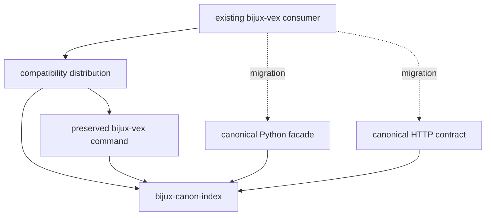

# bijux-vex

`bijux-vex` preserves the earlier index distribution, Python import, and
console command for `bijux-canon-index`. The canonical package owns vector
execution planning, capability resolution, state backends, ranked results,
replay comparison, and provenance.

The executable requires special care: `bijux-canon-index` intentionally
publishes no canonical console script. There is no `bijux-canon-index` command
to substitute for `bijux-vex`.

## Identity Contract

| Surface | Preserved identity | Canonical identity |
| --- | --- | --- |
| distribution | `bijux-vex` | `bijux-canon-index` |
| Python root | `bijux_vex` | `bijux_canon_index` |
| console command | `bijux-vex` | no direct executable replacement |
| nested CLI module | `bijux_vex.interfaces.cli.app` | `bijux_canon_index.interfaces.cli.app` |
| representative nested type | `bijux_vex.core.runtime.execution_plan.ExecutionPlan` | `bijux_canon_index.core.runtime.execution_plan.ExecutionPlan` |



The bridge command delegates to the canonical index Typer application, but its
continued presence is a compatibility property. It must not be interpreted as
a canonical command contract for new systems.

## Existing Import Continuity

```bash
python -m pip install bijux-vex
bijux-vex --help
python -m bijux_vex --help
```

```python
from bijux_vex.core.runtime.execution_plan import ExecutionPlan
```

The nested import resolves to the canonical class object. New Python code uses
the canonical distribution and import root:

```bash
python -m pip install bijux-canon-index
```

```python
from bijux_canon_index.core.runtime.execution_plan import ExecutionPlan
```

Prefer the documented public facade over a deep path whenever it exports the
operation or type required by the consumer.

## Replace Command Integrations Deliberately

Do not mechanically rename `bijux-vex` to `bijux-canon-index`. Instead:

1. identify the exact index operation, inputs, configuration, exit handling,
   and consumed outputs;
2. select the corresponding canonical Python or versioned HTTP contract;
3. implement the integration at that boundary;
4. compare ranked results, typed failures, and retained execution evidence for
   representative cases; and
5. keep the bridge installed until every deployed command caller has moved.

The [index handbook](../../03-bijux-canon-index/index.md) defines current
behavior and supported integration surfaces. The bridge's identity tests do
not freeze arbitrary internal modules, private CLI behavior, or all historical
artifact layouts.

## Repository Ownership

Current source, issues, release metadata, and documentation are owned by
`bijux/bijux-canon`. The former `bijux/bijux-vex` repository is historical
context rather than an active implementation authority.

Continue with [command surfaces](command-surfaces.md) for the full command map
and [migration guidance](../migration/migration-guidance.md) for the migration
evidence checklist.
