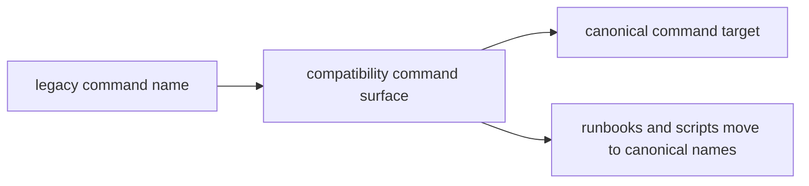

# Command Surfaces

Some compatibility packages preserve legacy CLI names so migration does not
break operator scripts immediately. A preserved command is a safety rail on the
way to the canonical package, not a reason to keep new automation on the old
name.

## Command Bridge

This page should let operators see both sides of the bridge at once: what old
name still works today and what canonical command should replace it in active
automation.

## Current Command Map

- `agentic-flows` -> `bijux-canon-runtime`
- `bijux-agent` -> `bijux-canon-agent`
- `bijux-rag` -> `bijux-canon-ingest`
- `bijux-rar` -> `bijux-canon-reason`
- `bijux-vex` -> `bijux-canon-index`

## Review Rule

Keep a compatibility command only when a real supported environment still calls
it. Once scripts and runbooks move to the canonical command, the compatibility
name is retirement debt.

## First Proof Check

- `packages/compat-*`
- compatibility package metadata and README files
- repository-wide search for remaining legacy CLI usage

## Design Pressure

If a preserved command reads like a stable long-term interface, automation will
keep depending on it forever. The bridge has to stay safe enough for continuity
but pointed enough to drive migration.
