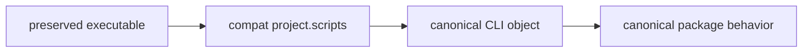

# Command Surfaces

Every compatibility distribution preserves one console command and the
equivalent `python -m <compat_import>` invocation. Both routes dispatch a
canonical package's CLI object directly. The bridge does not own a parser,
argument translation, or command-specific business logic.

## Executable Map

| Preserved command | Canonical owner | Preferred replacement | Canonical entrypoint |
| --- | --- | --- | --- |
| `bijux-canon` | `bijux-canon-runtime` | `bijux-canon-runtime` | `bijux_canon_runtime.interfaces.cli.entrypoint:main` |
| `agentic-flows` | `bijux-canon-runtime` | `bijux-canon-runtime` | `bijux_canon_runtime.interfaces.cli.entrypoint:main` |
| `bijux-agent` | `bijux-canon-agent` | `bijux-canon-agent` | `bijux_canon_agent.interfaces.cli.entrypoint:cli` |
| `bijux-rag` | `bijux-canon-ingest` | `bijux-canon-ingest` | `bijux_canon_ingest.interfaces.cli.entrypoint:main` |
| `bijux-rar` | `bijux-canon-reason` | `bijux-canon-reason` | `bijux_canon_reason.interfaces.cli:app` |
| `bijux-vex` | `bijux-canon-index` | Python or HTTP index contract | `bijux_canon_index.interfaces.cli.app:app` |

`bijux-vex` has no direct canonical executable replacement. The
`bijux-canon-index` distribution intentionally publishes no console script.
Existing `bijux-vex` automation continues to reach the index Typer application
through the bridge, while new integrations use the index Python or HTTP
contract.


```mermaid
flowchart LR
    shell["preserved executable"]
    metadata["compat project.scripts"]
    cli["canonical CLI object"]
    behavior["canonical package behavior"]

    shell --> metadata --> cli --> behavior
```

## Console And Module Invocation

Installing a bridge provides two compatibility routes. For example,
`bijux-rag` supports:

```bash
bijux-rag --help
python -m bijux_rag --help
```

The console script is declared in the bridge's `pyproject.toml` and points to
the canonical entrypoint. The local `bijux_rag.__main__` imports that same
entrypoint. This arrangement preserves executable discovery and module
execution without duplicating the ingest CLI.

## What Command Continuity Establishes

| Observation | Supported conclusion | Limit |
| --- | --- | --- |
| preserved command resolves | bridge installation registered the executable | does not prove a real operation succeeds |
| `--help` renders | canonical parser can be reached | does not verify configuration, storage, or providers |
| representative operation matches | tested arguments reach canonical behavior | applies to the exercised operation and environment |
| output artifact remains readable | tested consumer accepts canonical output | does not promise every historical private format |

Exit codes, stdout and stderr, environment lookup, filesystem effects, and
artifacts belong to the canonical CLI reached by the bridge. A migration must
therefore test the consumer's real invocation, not merely compare command
names.

## Replace A Preserved Command

1. Identify every shell script, workflow, container entrypoint, service unit,
   and runbook that invokes the preserved name.
2. Replace it with the preferred executable where the matrix provides one.
3. Compare exit status and consumed outputs using the integration's actual
   arguments.
4. For `bijux-vex`, map the requested operation to the index Python or HTTP
   contract and add an integration test at that boundary.
5. Remove the compatibility dependency only after every deployed caller has
   moved.

See [migration guidance](../migration/migration-guidance.md) for the complete
surface inventory and [validation strategy](../migration/validation-strategy.md)
for evidence expected before removal.
