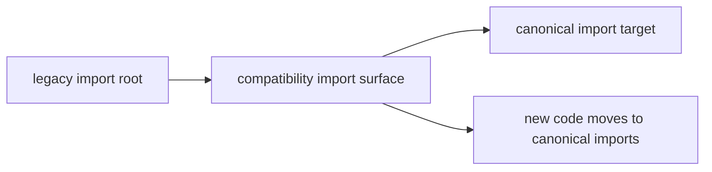

# Import Surfaces

Compatibility imports exist so older code can keep resolving package names while
migration is underway. They are continuity aids, not first-class imports for
new code.

## Import Bridge

This page should make the import story obvious: old code keeps resolving while
new code moves to the canonical root. The preserved import is a migration tool,
not a design endorsement.

## Current Import Map

- `agentic_flows` -> `bijux_canon_runtime`
- `bijux_agent` -> `bijux_canon_agent`
- `bijux_rag` -> `bijux_canon_ingest`
- `bijux_rar` -> `bijux_canon_reason`
- `bijux_vex` -> `bijux_canon_index`

## Review Rule

A preserved import is justified only while supported code still depends on it.
New code should use canonical imports even if the compatibility import still
resolves.

## First Proof Check

- `packages/compat-*`
- compatibility package `README.md` routing
- repository-wide search for remaining legacy imports

## Design Pressure

If compatibility imports read like a supported long-term API surface, the
migration pressure disappears. The bridge has to stay useful without sounding
comfortable.
