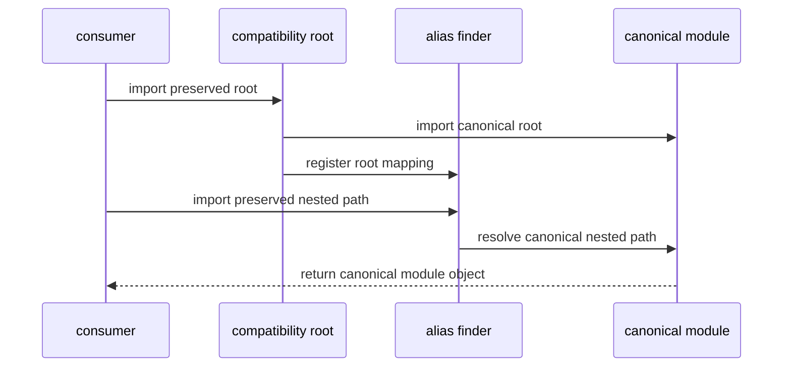

# Import Surfaces

Compatibility imports resolve established Python roots and representative
nested paths to the canonical implementation. They preserve object identity:
a class imported through a bridge is the same class object exposed by the
canonical module, rather than a subclass or wrapper.

## Import Map

| Preserved root | Canonical root | Representative verified nested path | Verified identity |
| --- | --- | --- | --- |
| `bijux_canon` | `bijux_canon_runtime` | `bijux_canon.model.flows.manifest` | `FlowManifest` |
| `agentic_flows` | `bijux_canon_runtime` | `agentic_flows.model.flows.manifest` | `FlowManifest` |
| `bijux_agent` | `bijux_canon_agent` | `bijux_agent.contracts.execution_plan` | `ExecutionPlan` |
| `bijux_rag` | `bijux_canon_ingest` | `bijux_rag.core.types` | `RawDoc` |
| `bijux_rar` | `bijux_canon_reason` | `bijux_rar.core` | `Claim` |
| `bijux_vex` | `bijux_canon_index` | `bijux_vex.core.runtime.execution_plan` | `ExecutionPlan` |

The representative paths are executable contract evidence, not permission to
depend on every internal canonical module. Supported use remains bounded by
the canonical package's public facade.

## How A Nested Import Resolves


```mermaid
sequenceDiagram
    participant C as consumer
    participant B as compatibility root
    participant F as alias finder
    participant K as canonical module

    C->>B: import preserved root
    B->>K: import canonical root
    B->>F: register root mapping
    C->>F: import preserved nested path
    F->>K: resolve canonical nested path
    K-->>C: return canonical module object
```

The bridge root publishes the canonical `__all__`, forwards missing attribute
lookups, and includes canonical names in `dir()`. Its meta-path finder maps a
non-local nested suffix to the same suffix beneath the canonical root and
registers the canonical module object under the preserved path.

Only `__main__` and `runtime_alias` remain local to each bridge. They provide
module execution and alias machinery; they are not product API.

## Root And Nested Migration

A root-only edit can leave compatibility dependencies hidden in nested imports:

```python
# preserved
from bijux_rag.core.types import RawDoc

# canonical
from bijux_canon_ingest.core.types import RawDoc
```

When the required symbol is part of the public facade, prefer the shallower
canonical import:

```python
from bijux_canon_ingest import RawDoc
```

Inventory dynamic imports, plugin configuration, serialized dotted paths, and
type-checker configuration in addition to ordinary `import` statements.
Successful runtime resolution does not prove that static analysis, generated
documentation, pickled references, or external plugin loaders accept the new
name.

## Compatibility Boundary

The bridges verify that:

- root `__all__` follows the canonical package;
- selected root exports compare equal;
- CLI modules resolve to the canonical module object; and
- representative nested types retain identity.

They do not freeze arbitrary private module paths. New code should import from
the canonical public facade, and migration tests should exercise the specific
nested paths a consumer actually used.

Continue with [package behavior](package-behavior.md) for the bridge mechanism
or [dependency continuity](../migration/dependency-continuity.md) for the
same-version installation contract.
