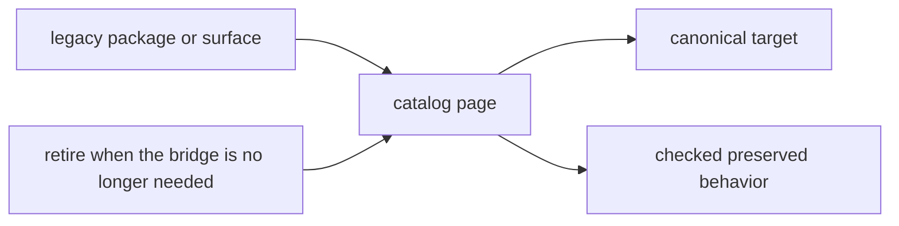

# Catalog

The catalog is the concrete half of the compatibility handbook. It tells you
which legacy names still ship, what they preserve, and which canonical package
now owns the real behavior.

These pages should be quick to scan and hard to misread. A reader should be
able to land on an old name, find the current target immediately, and tell
whether the compatibility layer is still thin enough to justify itself.

## Catalog Model

The catalog only works when it answers the first practical question fast:
what does this old name still point to now? After that, the page has to make
the remaining bridge visible enough that readers can judge whether the
compatibility surface is still honest or just lingering.

## Catalog Pages

- [agentic-flows](https://bijux.io/bijux-canon/08-compat-packages/catalog/agentic-flows/)
- [bijux-agent](https://bijux.io/bijux-canon/08-compat-packages/catalog/bijux-agent/)
- [bijux-rag](https://bijux.io/bijux-canon/08-compat-packages/catalog/bijux-rag/)
- [bijux-rar](https://bijux.io/bijux-canon/08-compat-packages/catalog/bijux-rar/)
- [bijux-vex](https://bijux.io/bijux-canon/08-compat-packages/catalog/bijux-vex/)
- [Legacy Name Map](https://bijux.io/bijux-canon/08-compat-packages/catalog/legacy-name-map/)
- [Package Behavior](https://bijux.io/bijux-canon/08-compat-packages/catalog/package-behavior/)
- [Import Surfaces](https://bijux.io/bijux-canon/08-compat-packages/catalog/import-surfaces/)
- [Command Surfaces](https://bijux.io/bijux-canon/08-compat-packages/catalog/command-surfaces/)

## Start With

- Open an individual package page when you already know the legacy package
  name.
- Open [Legacy Name Map](https://bijux.io/bijux-canon/08-compat-packages/catalog/legacy-name-map/)
  for the full bridge table.
- Open [Import Surfaces](https://bijux.io/bijux-canon/08-compat-packages/catalog/import-surfaces/)
  or [Command Surfaces](https://bijux.io/bijux-canon/08-compat-packages/catalog/command-surfaces/)
  when the compatibility risk is one public surface rather than one package.

## Checked Surfaces

- legacy distribution names on PyPI
- preserved Python import roots
- preserved CLI names where they still exist
- compatibility package metadata and README routing

## Boundary

The catalog identifies what still exists. It does not justify keeping those
surfaces forever. Retirement and continuity decisions belong in the migration
section.

## Design Pressure

If a catalog page hides the canonical target, the preserved behavior, or the
remaining migration cost, the compatibility layer starts looking permanent.
This section has to stay closer to a ledger than a landing page.
