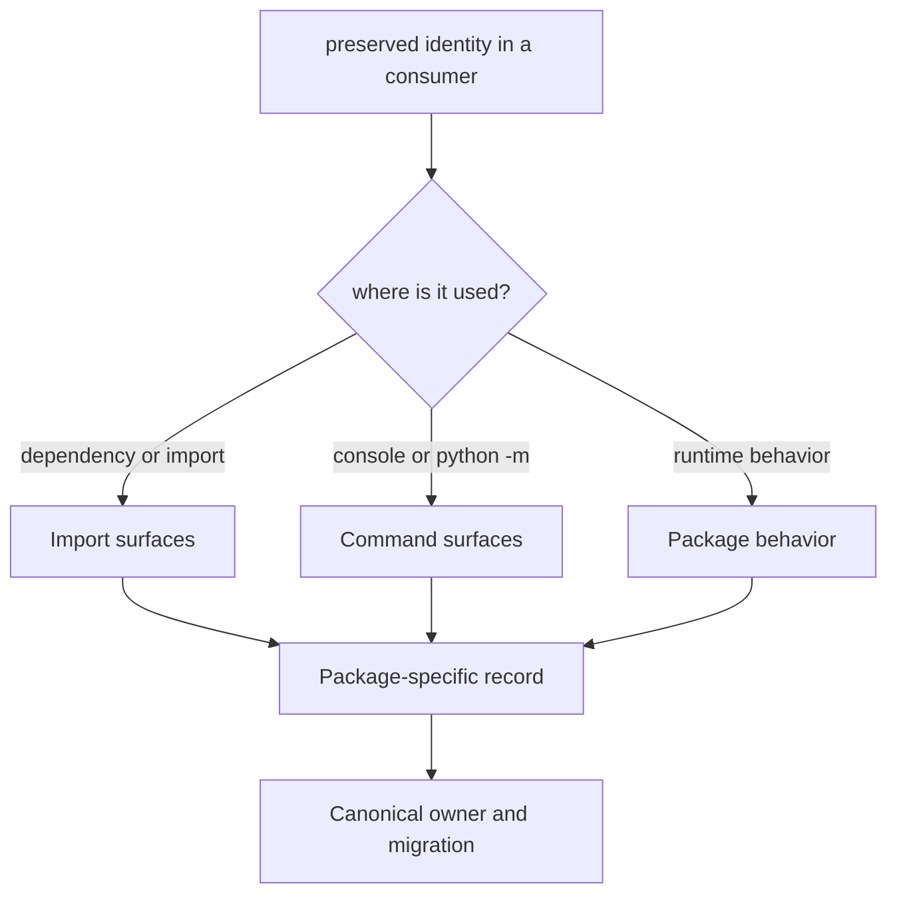
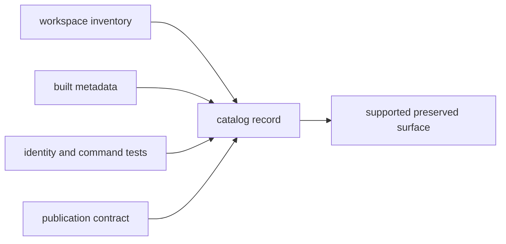

# Compatibility Catalog

Use the catalog to resolve a preserved distribution, Python root, or command
to its canonical owner. Every entry records the surfaces still delegated by the
bridge, the behavior that remains canonical, and the migration work required
to leave the preserved identity.

## Resolve a Name

| Preserved identity | Canonical destination | Important migration boundary | Package record |
| --- | --- | --- | --- |
| `bijux-canon` | `bijux-canon-runtime` | runtime imports, commands, manifests, and run stores | [bijux-canon](bijux-canon.md) |
| `agentic-flows` | `bijux-canon-runtime` | flow manifests, replay automation, imports, and commands | [agentic-flows](agentic-flows.md) |
| `bijux-agent` | `bijux-canon-agent` | orchestration imports, provider configuration, commands, and traces | [bijux-agent](bijux-agent.md) |
| `bijux-rag` | `bijux-canon-ingest` | preparation imports, commands, caches, and artifact readers | [bijux-rag](bijux-rag.md) |
| `bijux-rar` | `bijux-canon-reason` | reasoning imports, commands, run bundles, and verification | [bijux-rar](bijux-rar.md) |
| `bijux-vex` | `bijux-canon-index` | vector contracts, module execution, provenance, and command redesign | [bijux-vex](bijux-vex.md) |

The [legacy name map](legacy-name-map.md) gives the compact distribution,
module, command, and retired-repository mapping. Use the package records when
the consumer depends on nested imports, stored artifacts, or command-specific
behavior.

## Inspect by Surface

```mermaid
flowchart TD
    identity["preserved identity in a consumer"] --> kind{"where is it used?"}
    kind -->|"dependency or import"| imports["Import surfaces"]
    kind -->|"console or python -m"| commands["Command surfaces"]
    kind -->|"runtime behavior"| behavior["Package behavior"]
    imports --> package["Package-specific record"]
    commands --> package
    behavior --> package
    package --> target["Canonical owner and migration"]
```

| Question | Record |
| --- | --- |
| Which root and nested modules are delegated? | [Import surfaces](import-surfaces.md) |
| Which console scripts and module routes remain? | [Command surfaces](command-surfaces.md) |
| Which behavior is preserved, and who owns defects? | [Package behavior](package-behavior.md) |
| What is the exact old-to-current mapping? | [Legacy name map](legacy-name-map.md) |

## Evidence Behind a Catalog Entry

A current package entry is backed by four independent facts:

1. the root workspace inventory declares the compatibility package and its
   directory;
2. built metadata injects an exact dependency on the canonical distribution;
3. bridge tests exercise root exports, representative nested imports, local
   alias modules, and command delegation; and
4. publication contracts verify package contents, project URLs, the preserved
   script, and canonical ownership language.

```mermaid
flowchart LR
    workspace["workspace inventory"] --> record["catalog record"]
    wheel["built metadata"] --> record
    tests["identity and command tests"] --> record
    publish["publication contract"] --> record
    record --> consumer["supported preserved surface"]
```

Package-index existence is checked separately from repository declarations. A
catalog entry proves what this source tree is designed and tested to publish;
it does not prove that every release version is available from every channel.

## Boundary of the Bridge

A compatibility package may contain forwarding and packaging infrastructure.
It may not introduce product algorithms, schemas, configuration defaults,
storage formats, failure interpretation, or a compatibility-only feature. Fix
product behavior in the canonical package and verify that the bridge observes
the corrected behavior without translation.

When a consumer no longer appears to need a preserved identity, continue with
[migration validation](../migration/validation-strategy.md) and
[retirement conditions](../migration/retirement-conditions.md). Repository
search is only the start of that decision; deployed dependencies, commands,
images, plugins, and artifact readers must also be accounted for.
